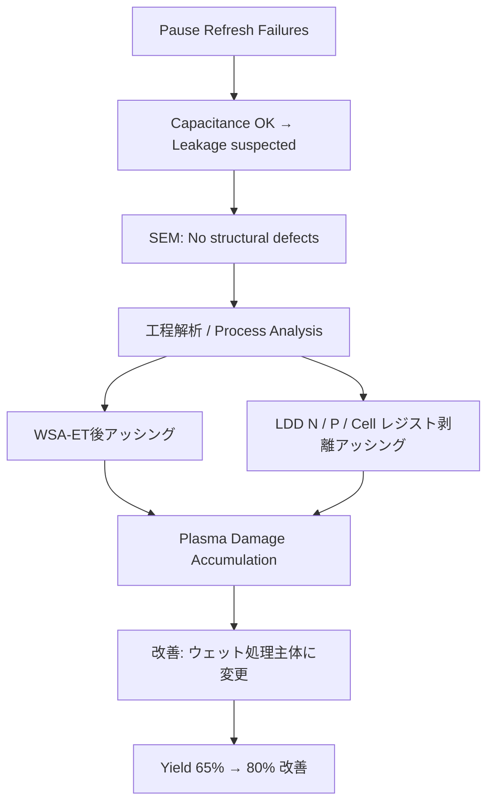

---

# 📘 64M DRAM 第3世代（0.25μm）立ち上げ記録 （1998）  
**📘 64M DRAM 3rd Generation (0.25 μm) Startup Record (1998)**  

---

> 🗓️ **背景リンク / Background Link**  
> 本プロジェクトの基盤となった **8インチライン立ち上げと第2世代（0.35μm）DRAM立ち上げの経緯** は以下を参照。  
> **[1997年：セイコーエプソン酒田事業所8インチライン稼働](../in1997/Epson_Sakata_8inch_Line.md)**

---

⚠️ **免責事項 / Disclaimer**  

| 日本語 | English |
|--------|---------|
| 本記録は1998年当時の技術移管・立ち上げ業務の体験に基づく教育資料です。エプソン社におけるDRAMは主力製品ではなく、本記録には現在の事業機密や設計情報は含まれません。 | This document is based on the author's actual experience during a technology transfer and ramp-up in 1998. At Epson, DRAM was not a core product. This archive contains no proprietary or confidential design data. |

---

## 🧭 プロジェクト概要 | Project Overview

| 項目 / Item             | 内容 / Details                                                |
|------------------------|---------------------------------------------------------------|
| 製品名 / Product       | 64M DRAM（第3世代 / 0.25μm）                                  |
| 年度 / Year            | 1998年 / 1998                                                 |
| 担当者 / Role          | 三溝真一（Shinichi Samizo, 技術担当 / Technical Engineer）         |
| 移管元 / Transfer Fab   | 三菱電機 熊本工場 KD棟（Mother Fab） / Mitsubishi Electric Kumamoto Fab (KD Building) |
| 立ち上げ先 / Ramp-up Site | セイコーエプソン 酒田工場 T棟 / Seiko Epson Sakata Fab (T Building) |

---

## 🏗️ プロセス立ち上げの役割と戦略 | Role & Ramp-up Strategy

**日本語**  
0.25μm世代DRAMの量産立ち上げに技術担当として参画。KD工場から提供された**フロッピー2枚分のプロセス条件**をT工場に展開し、工程流動を可能にした。  
その後、不良解析・歩留まり改善・信頼性評価にも関与した。  

**English**  
Participated in the 0.25 μm 64M DRAM mass production ramp-up as a technical engineer. Specifically deployed **two floppy disks worth of process parameters** from the KD Fab to the T Fab, enabling wafer process flow.  
Subsequently engaged in **failure analysis, yield improvement, and reliability evaluation** during the production transition.  

---

### 🔄 本番ロット投入前フロー | Pre-Mass Production Ramp-up Flow (1998)

**日本語**  
採用した方式は **SCF（ショートサイクルフィードバック）**。  
各要素技術部門の立ち上げマニュアルを基に、短サイクルで評価・修正を繰り返し、条件を早期にFixした。  

1. KD工場より**フロッピー2枚分の条件データ**を受領  
2. 各要素技術（拡散・CVD・PVD・エッチングなど）へ展開  
3. 電子流動票に条件反映  
4. **形式ロット10投入**（形状確認・条件最適化）  
5. SCFにより条件修正・最適化  
6. 最終条件を電子流動票に反映  
7. **本番ロット3投入（長期信頼性用）**  
8. **バーンイン評価3ロット投入**  
9. 信頼性確認後、量産移行  

> **注記**: 実際の立ち上げではSCF方式によりモニタロットや条件検証用ロットが随時投入されていたが、正式な評価ロットとしては上記の「10＋3＋3」に整理される。  

---

## 📊 フェーズ別の解析と改善 | Phase-by-Phase Analysis & Improvements

| フェーズ / Phase | 日本語 | English |
|-----------------|--------|---------|
| 🔹 形式ロット投入 | **10ロット投入** – SCFで条件最適化 | **10 lots introduced** – Process optimization by SCF |
| 🔹 本番ロット投入 | **3ロット投入（長期信頼性評価用）** | **3 lots for long-term reliability** |
| 🔹 バーンイン評価 | **3ロット投入（Burn-in試験用）** | **3 lots for burn-in test** |
| 📉 初回歩留まり | 約 **65%**、主不良は **ポーズリフレッシュ不良** | Initial yield ~65%, main defect was **Pause Refresh failure** |
| 🔍 不良解析 | **Pause Refresh条件でのビットエラー原因調査** | Investigation of bit errors under **Pause Refresh** conditions |
| ⚡ 容量確認 | **セル容量は正常 → SNコンタクト〜N+/P-Wellリーク疑い** | Cell capacitance normal → suspected leakage between SN contact and N+/P-Well |
| 🧐 SEM観察 | 構造欠陥なし（THB領域含む） | No structural defects found (incl. THB area) |
| 📌 原因特定 | **WSA-ETドライエッチ後・LDD複数回レジスト剥離アッシングによるプラズマダメージ** | **Plasma damage from resist ashing after WSA-ET dry etch and multiple LDD steps** |
| 🛠️ 改善処置 | レジスト剥離を**ウェット処理主体へ変更**（アッシング最小化） | Changed resist strip to **wet process** (minimized ashing) |
| ✅ 結果 | 歩留まり **65% → 80%**、信頼性試験クリア | Yield improved **65% → 80%**, passed reliability tests |

---

## 🔄 改善プロセス因果関係 | Improvement Process Flow

---

## 🧪 ポーズリフレッシュ不良とは | What is Pause Refresh Failure?

| 日本語 | English |
|--------|---------|
| DRAMセルの電荷保持性を検証するため、リフレッシュを一時停止後に読み出しを行う試験で発生する不良。 | A DRAM failure mode detected by halting refresh temporarily and reading the cell to assess charge retention. |

[Bin分類資料（Bin5）](dram_wafer_test_binclass_0.25um.md#bin5)

---

## 📂 プロセスフロー | Process Flow

- 📄 **[DRAM_Process_Flow_Full.md](./DRAM_Process_Flow_Full.md)** – 0.25μm 64M DRAM（第3世代）の**フルプロセスフロー（日本語版）**  
- 📄 **[DRAM_Process_Flow_Full_en.md](./DRAM_Process_Flow_Full_en.md)** – **Full process flow** for 0.25 μm 64M DRAM (English)

---

## 📎 関連資料 | Related Materials

- **[DRAMメーカー比較 (1998)](DRAM_Maker_Comparison_1998.md)**  
- **[DRAMセル構造比較](DRAM_Cell_Structure_Comparison.md)**  
- **[DRAM技術年表](DRAM_Cell_Technology_Chronology.md)**  
- **[0.25μm Bin分類](dram_wafer_test_binclass_0.25um.md)**  

---

## 📅 技術アーカイブ年表 | Technical Archive Timeline

- [1997年：エプソン酒田8インチライン稼働](../in1997/Epson_Sakata_8inch_Line.md)  
- **1998年：0.25μm DRAM立ち上げ（本ページ）**  
- [2001年：VSRAM課題対策](../in2001/VSRAM_2001.md)  

---

📘 **本記録は教育・アーカイブ目的で再構成されたものであり、企業機密とは一切関係ありません。**  
