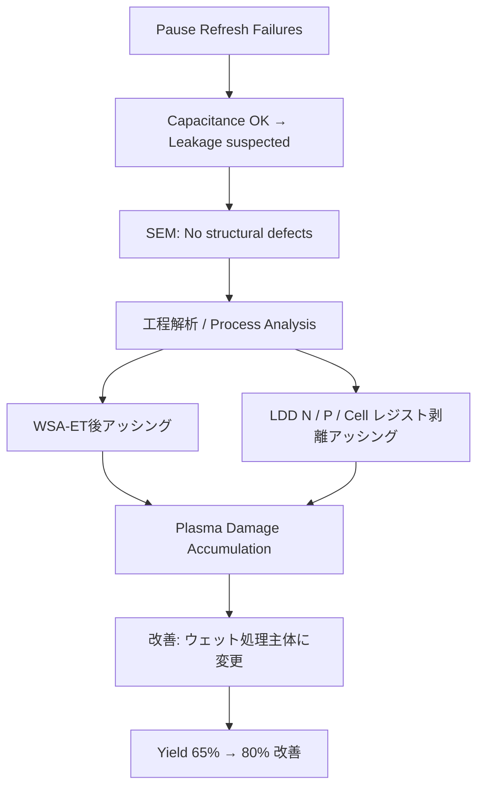

---

# 📘 64M DRAM 第3世代（0.25μm）立ち上げ記録 （1998）  
**📘 64M DRAM 3rd Generation (0.25 μm) Startup Record (1998)**  

---

> 🗓️ **背景リンク / Background Link**  
> 本プロジェクトの基盤となった **8インチライン立ち上げと第2世代（0.35μm）DRAM立ち上げの経緯** は以下を参照。  
> **[1997年：セイコーエプソン酒田事業所8インチライン稼働](../in1997/Epson_Sakata_8inch_Line.md)**

---

⚠️ **免責事項 / Disclaimer**  

| 日本語 | English |
|--------|---------|
| 本記録は1998年当時の技術移管・立ち上げ業務の体験に基づく教育資料です。エプソン社におけるDRAMは主力製品ではなく、本記録には現在の事業機密や設計情報は含まれません。 | This document is based on the author's actual experience during a technology transfer and ramp-up in 1998. At Epson, DRAM was not a core product. This archive contains no proprietary or confidential design data. |

---

## 🧭 プロジェクト概要 | Project Overview

| 項目 / Item             | 内容 / Details                                                |
|------------------------|---------------------------------------------------------------|
| 製品名 / Product       | 64M DRAM（第3世代 / 0.25μm）                                  |
| 年度 / Year            | 1998年 / 1998                                                 |
| 担当者 / Role          | 三溝真一（Shinichi Samizo, 技術担当 / Technical Engineer）         |
| 移管元 / Transfer Fab   | 三菱電機 熊本工場 KD棟（Mother Fab） / Mitsubishi Electric Kumamoto Fab (KD Building) |
| 立ち上げ先 / Ramp-up Site | セイコーエプソン 酒田工場 T棟 / Seiko Epson Sakata Fab (T Building) |

---

### 🔄 本番ロット投入前フロー | Pre-Mass Production Ramp-up Flow (1998)

**日本語**  
採用した方式は **SCF（ショートサイクルフィードバック）**。  
各要素技術部門の立ち上げマニュアルを基に、短サイクルで評価・修正を繰り返し、条件を早期にFixした。  
*The method adopted was **SCF (Short Cycle Feedback)**. Based on ramp-up manuals of each unit process, short-cycle evaluation and adjustments were repeated to quickly fix the process conditions.*  

1. KD工場より **フロッピー2枚分の条件データ** を受領  
   *Received two floppy disks of process data from KD fab*  
2. 各要素技術（拡散・CVD・PVD・エッチングなど）へ展開  
   *Deployed to each unit process (diffusion, CVD, PVD, etching, etc.)*  
3. 電子流動票に条件反映  
   *Reflected conditions into the electronic traveler*  
4. **形式ロット10投入**（形状確認・条件最適化、うち数ロットはマージン条件を組込み）  
   ***10 lots introduced** (for pattern check and process optimization, some with margin conditions)*  
5. SCFにより条件修正・最適化  
   *Optimized by SCF cycles*  
6. 最終条件を電子流動票に反映  
   *Final conditions reflected in the electronic traveler*  
7. **本番ロット3投入（長期信頼性用）＋ マージンロット同時投入**  
   ***3 production lots (long-term reliability) + margin lots in parallel***  
8. **バーンイン評価3ロット投入**  
   ***3 burn-in lots introduced***  
9. 信頼性確認後、量産移行  
   *Transitioned to mass production after reliability confirmation*  

> **注記**  
> 移管開発では設計変更は行わず、本番ロットとマージンロットを並行投入した。  
> 本番ロットは信頼性・歩留まり確認、マージンロットは **設計マージン＝プロセスウインドウ** の再現性確認を目的とした。  
> したがって、マージンロットの結果を待ってから本番投入する必要はなかった。  
> *In technology transfer, no design changes were made, and production lots and margin lots were introduced in parallel.  
> Production lots were for reliability/yield confirmation, while margin lots were for confirming the reproducibility of the **design margin = process window**.  
> Therefore, production lots did not need to wait for the margin lot results.*  
>
> **マージン＝プロセスウインドウ（代表条件）**  
> - NMOS Vth High / Low / Typ  
> - PMOS Vth High / Low / Typ  
> - ゲート長（Lgate）下限 / 上限  
> → 合計7〜8条件を流動し、Typ条件と比較して歩留まり・動作が設計範囲内にあることを確認した。  
> *Margin = Process Window (examples):  
> - NMOS Vth High / Low / Typ  
> - PMOS Vth High / Low / Typ  
> - Gate length (Lgate) min / max  
> → A total of 7–8 conditions were run, confirming that yield and operation stayed within the design window compared to Typ conditions.*  

---

## 📊 フェーズ別の解析と改善 | Phase-by-Phase Analysis & Improvements

| フェーズ / Phase | 日本語 | *English* |
|-----------------|--------|-----------|
| 🔹 形式ロット投入 | **10ロット投入（内数ロットはマージン条件）** – SCFで条件最適化 | *10 lots (incl. margin conditions) – Process optimization by SCF* |
| 🔹 本番＋マージンロット投入 | **3ロット本番（長期信頼性用）＋ マージンロット並行投入** | *3 lots for long-term reliability + margin lots in parallel* |
| 🔹 バーンイン評価 | **3ロット投入（Burn-in試験用）** | *3 lots for burn-in test* |
| 📉 初回歩留まり | 約 **65%**、主不良は **ポーズリフレッシュ不良** | *Initial yield ~65%, main defect was Pause Refresh failure* |
| 🔍 不良解析 | **Pause Refresh条件でのビットエラー原因調査** | *Investigation of bit errors under Pause Refresh conditions* |
| ⚡ 容量確認 | **セル容量は正常 → SNコンタクト〜N+/P-Wellリーク疑い** | *Cell capacitance normal → suspected leakage between SN contact and N+/P-Well* |
| 🧐 SEM観察 | 構造欠陥なし（THB領域含む） | *No structural defects found (incl. THB area)* |
| 📌 原因特定 | **WSA-ETドライエッチ後・LDD複数回レジスト剥離アッシングによるプラズマダメージ** | *Plasma damage from resist ashing after WSA-ET dry etch and multiple LDD steps* |
| 🛠️ 改善処置 | レジスト剥離を **ウェット処理主体へ変更**（アッシング最小化） | *Changed resist strip to wet process (minimized ashing)* |
| ✅ 結果 | 歩留まり **65% → 80%**、信頼性試験クリア | *Yield improved 65% → 80%, passed reliability tests* |

---

## 🔄 改善プロセス因果関係 | Improvement Process Flow

---

## 🧪 ポーズリフレッシュ不良とは | What is Pause Refresh Failure?

DRAMセルの電荷保持性を検証するため、リフレッシュを一時停止後に読み出しを行う試験で発生する不良。  
*A DRAM failure mode detected by halting refresh temporarily and reading the cell to assess charge retention.*

📎 詳細は **[Bin分類資料（Bin5）](dram_wafer_test_binclass_0.25um.md#bin5)** を参照。  
See **[Bin Classification Data (Bin5)](dram_wafer_test_binclass_0.25um.md#bin5)** for details.

---

### 🔍 補足解説 | Supplementary Notes

#### 1. 意味と位置づけ | Meaning and Context
- **定義**: DRAM のリフレッシュ動作を意図的に停止し、一定時間経過後にセルを読み出す試験で観測される不良。  
  *Definition: A failure observed when DRAM refresh is intentionally paused, then the cells are read after a retention interval.*  
- **目的**: セルの電荷保持性（リーク電流の大小）を判定し、**長期データ保持能力**を評価する。  
  *Purpose: To determine charge retention capability (leakage current magnitude) and evaluate long-term data holding ability.*

#### 2. 物理的背景 | Physical Background

- DRAM セルはキャパシタに蓄積した電荷を保持するが、リーク電流（\(I_{leak}\)）により徐々に放電していく。  
- リークの主な発生要因は以下の通り：

1. **ストレージノード / セルプレート間 ONO リーク**  
   *ONO (Oxide-Nitride-Oxide) dielectric leakage between the storage node and the cell plate*  
   - キャパシタ絶縁膜（ONO 積層膜）のトンネル電流や欠陥由来リーク。  
   - セル保持特性を直接左右する主要因。  

2. **拡散層ジャンクションリーク**  
   *Reverse-biased junction leakage from the access transistor diffusion region*  
   - ソース/ドレイン拡散層と基板の pn 接合に生じる逆方向リーク電流。  
   - 温度依存性が強く、セル保持時間のばらつき要因となる。  

3. **欠陥リーク**  
   *Defect-induced leakage (process or material defects)*  
   - 結晶欠陥、コンタクト不良、微小ショートなどによるリーク。  
   - ランダム分布するため、ウエハマップ上では点在不良として現れる。  

*DRAM cells retain charge in a capacitor but gradually lose it due to leakage currents.  
Main sources include ONO dielectric leakage between storage node and cell plate, reverse-biased junction leakage, and defect-induced leakage.*
*DRAM cells retain charge in a capacitor but gradually lose it due to leakage currents. Major contributors: oxide tunneling, junction leakage, and defect-related leakages.*

#### 3. 計測の難しさ | Measurement Difficulty
- セル単位リークは **~1 fA (10⁻¹⁵ A)** 程度（室温条件）。  
- 半導体パラメトリックテスタ（通常のプローバ環境）ではノイズフロアが高すぎて測定不能。  
- 実際には「暗室・遮蔽・低ノイズ計測環境」が必要 → **大手 DRAM メーカーのみが保有する特殊環境**。  

*Leakage per cell is ~1 fA at RT, below the detection limit of standard parametric testers. Measurements require ultra-low-noise environments (dark room, shielded, specialized setups), available only at leading DRAM manufacturers.*

#### 4. 不良分類上の位置 | Relation to Bin Classification
- ポーズリフレッシュ不良は **Bin5** に分類されることが多い。  
- この不良は「リフレッシュ周期延長耐性」や「セル均一性評価」に直結。  
- 量産テストでは **リフレッシュ停止 → 読み出し試験 → 不良検出 → Bin分け** という流れになる。  

*Pause refresh failures often fall under Bin5 classification, relating directly to refresh-cycle tolerance and cell uniformity evaluation. Mass testing typically involves pausing refresh, reading, detecting failures, and binning accordingly.*

#### 2.5 セル保持時間の式 | Retention Time Equation

セルの保持時間 τ は以下で近似される：

$$
\tau = \frac{C_{cell} \cdot V_{cell}}{I_{leak}}
$$

- \(C_{cell}\)：セルキャパシタ容量  
- \(V_{cell}\)：セルに保持される電圧  
- \(I_{leak}\)：リーク電流（ONOリーク・ジャンクションリーク・欠陥リークの総和）

この式から、リーク電流がわずか 1 fA レベルでも保持時間に直結することが分かる。

---

## 🗺️ 不良マップの特徴 | Failure Map Characteristics

### 分布傾向 | Distribution Trend
- **ビット単位の点在不良**として、ウエハ全面に散発的に現れる。  
- クラスタリングは弱く、**全面に薄く広がる点散布**が典型。  
- 周辺集中やライン欠陥とは異なり、**プロセス統計的ばらつき由来**。  

*Appears as scattered bit-level failures across the wafer, weak clustering, not edge/center concentrated, reflecting statistical process variations.*

#### 擬似ウエハマップ | Pseudo Wafer Map

**凡例 / Legend**  
- `.` = 良品セル（Pass）  
- `x` = ポーズリフレッシュ不良セル（Failure）  
    . . . x . . . . . . . . . x . . . . . .
    . . . . . . x . . . . . . . . . . . . .
    . . x . . . . . . . . x . . . . . . . .
    . . . . . . . x . . . . . . . . x . . .
    . . . x . . . . . . . . . . . . . . . .
    . . . . . . . x . . . . . . . . . . . .
    . . . . . x . . . . . . . . . x . . . .
    . . . . . . . . . x . . . . . . . . . .
    . . x . . . . . . . . . . . . . . . . .
    . . . . . . . x . . . . . x . . . . . .
    . . . . . . . . . . . . . . . . . x . .
    . . . . x . . . . . . . . . . . . . . .

> 📝 備考 / Notes\
> - **ウエハ全面に薄く点在**する傾向を表現。\
> *Shows lightly scattered dots across the wafer.*\
> - リフレッシュ停止時間を延ばすと `x` の密度が増加。\
> *Longer pause → higher defect density.*

---

## 📂 プロセスフロー | Process Flow

- 📄 **[DRAM_Process_Flow_Full.md](./DRAM_Process_Flow_Full.md)** – 0.25μm 64M DRAM（第3世代）の**フルプロセスフロー（日本語版）**  
- 📄 **[DRAM_Process_Flow_Full_en.md](./DRAM_Process_Flow_Full_en.md)** – **Full process flow** for 0.25 μm 64M DRAM (English)

---

## 📎 関連資料 | Related Materials

- **[DRAMメーカー比較 (1998)](DRAM_Maker_Comparison_1998.md)**  
- **[DRAMセル構造比較](DRAM_Cell_Structure_Comparison.md)**  
- **[DRAM技術年表](DRAM_Cell_Technology_Chronology.md)**  
- **[0.25μm Bin分類](dram_wafer_test_binclass_0.25um.md)**  

---

## 📅 技術アーカイブ年表 | Technical Archive Timeline

- [1997年：エプソン酒田8インチライン稼働](../in1997/Epson_Sakata_8inch_Line.md)  
- **1998年：0.25μm DRAM立ち上げ（本ページ）**  
- [2001年：VSRAM課題対策](../in2001/VSRAM_2001.md)  

---

📘 **本記録は教育・アーカイブ目的で再構成されたものであり、企業機密とは一切関係ありません。**  
