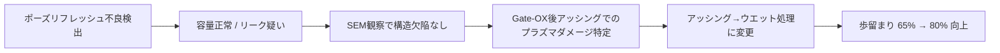

# 📘 64M DRAM 第3世代（0.25μm）立ち上げ記録 （1998）
📘 **64M DRAM 3rd Gen (0.25μm) Startup Record (1998)**  

---

⚠️ **免責事項 / Disclaimer**  

| 日本語 | English |
|--------|---------|
| 本記録は1998年当時の技術移管・立ち上げ業務の体験に基づく教育資料です。エプソン社におけるDRAMは主力製品ではなく、本記録には現在の事業機密や設計情報は含まれません。 | This document is based on the author's actual experience during a technology transfer and ramp-up in 1998. At Epson, DRAM was not a core product. This archive contains no proprietary or confidential design data. |

---

## 🧭 プロジェクト概要 | Project Overview

| 項目 / Item             | 内容 / Details                                                |
|------------------------|---------------------------------------------------------------|
| 製品名 / Product       | 64M DRAM（第3世代 / 0.25μm）                                  |
| 年度 / Year            | 1998年                                                       |
| 担当者 / Role          | 三溝真一（Shinichi Samizo, 技術担当 / Technical Engineer）         |
| 移管元 / Transfer Fab   | 三菱電機 熊本工場 KD棟（MotherFab） / Mitsubishi Electric Kumamoto Fab (KD Building) |
| 立ち上げ先 / Ramp-up Site | セイコーエプソン 酒田工場 T棟 / Seiko Epson Sakata Fab (T Building) |

---

## 🏗️ プロセス立ち上げの役割と戦略 | Role & Ramp-up Strategy

| 日本語 | English |
|--------|---------|
| 0.25μm世代DRAMの量産立ち上げに技術担当として参画。特にKD工場から提供されたフロッピー2枚分のプロセス条件をT工場に展開し、工程流動を可能にした。その後、不良解析・歩留まり改善・信頼性評価にも関与。 | Participated in the 0.25μm 64M DRAM ramp-up as a technical engineer. Specifically handled the deployment of process conditions (2 floppy disks) from the KD fab to the T fab, enabling wafer process flow. Also engaged in failure analysis, yield improvement, and reliability testing during the mass production transition. |

---

## 📊 フェーズ別の解析と改善 | Phase-by-Phase Analysis & Fix

| フェーズ | 内容 |
|---------|------|
| 🔹 本番ロット投入 | 信頼性評価用に **3ロット投入（Burn-in付き）** |
| 📉 初回歩留まり | 約 **65%**、主不良は **ポーズリフレッシュ不良** |
| 🔍 不良解析 | **Pause Refresh条件でのビットエラー原因を調査** |
| ⚡ 容量確認 | **セル容量は正常 → SNコンタクト〜N+/P-Well間リーク疑い** |
| 🧐 SEM観察 | SNコンタクト構造に大きな欠陥なし（THB領域含む） |
| 📌 原因特定 | **Gate-OX後のアッシングによるプラズマダメージ** |
| 🛠️ 改善処置 | アッシング → ウエット処理に変更しダメージを抑制 |
| ✅ 結果 | 歩留まり **約80%に向上**、信頼性試験クリアし量産へ |

---

### 🔄 改善プロセス因果関係 | Improvement Process Flow

---

## 🧪 ポーズリフレッシュ不良とは | What is Pause Refresh Failure?

| 日本語 | English |
|--------|---------|
| DRAMの電荷保持性を評価するため、リフレッシュを一時停止後にセル読み出しを行う試験で現れる不良。 | A DRAM failure mode detected by halting refresh operations temporarily and then reading the cell to assess charge retention. |

➡ 詳細は [Bin分類資料（Bin5）](./dram_wafer_test_binclass_0.25um.md) を参照。

---

## 📎 関連資料 | Related Materials

- **[DRAMメーカー比較 (1998)](DRAM_Maker_Comparison_1998.md)** – 各社DRAM技術動向
- **[DRAMセル構造比較](DRAM_Cell_Structure_Comparison.md)** – セルアーキテクチャの差異
- **[DRAM技術年表](DRAM_Cell_Technology_Chronology.md)** – 世代別プロセス変遷
- **[0.25μm Bin分類](dram_wafer_test_binclass_0.25um.md)** – 不良モード別分類

---

## 🔗 関連アーカイブ：VSRAM（2001年）

📄 [VSRAM_2001.md](../in2001/VSRAM_2001.md)  
> 🚀 **29歳時に推進したモバイル向け擬似SRAM**  
> DRAMプロセスを応用した革新メモリとして、世界初のカメラ付き携帯電話（SHARP製）に搭載。

---

## 📅 技術アーカイブ年表

- [1997年：セイコーエプソン酒田事業所8インチライン稼働](../in1997/Epson_Sakata_8inch_Line.md) – 本プロジェクトの製造基盤となった8インチラインの稼働開始
- **1998年：0.25μm DRAM立ち上げ（本ページ）**
- [2001年：VSRAM開発](../in2001/VSRAM_2001.md)

---

📘 **本記録は教育・アーカイブ目的で再構成されたものであり、企業機密とは一切関係ありません。**
