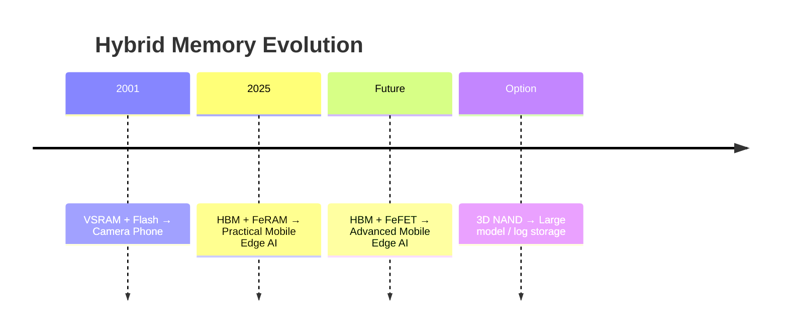
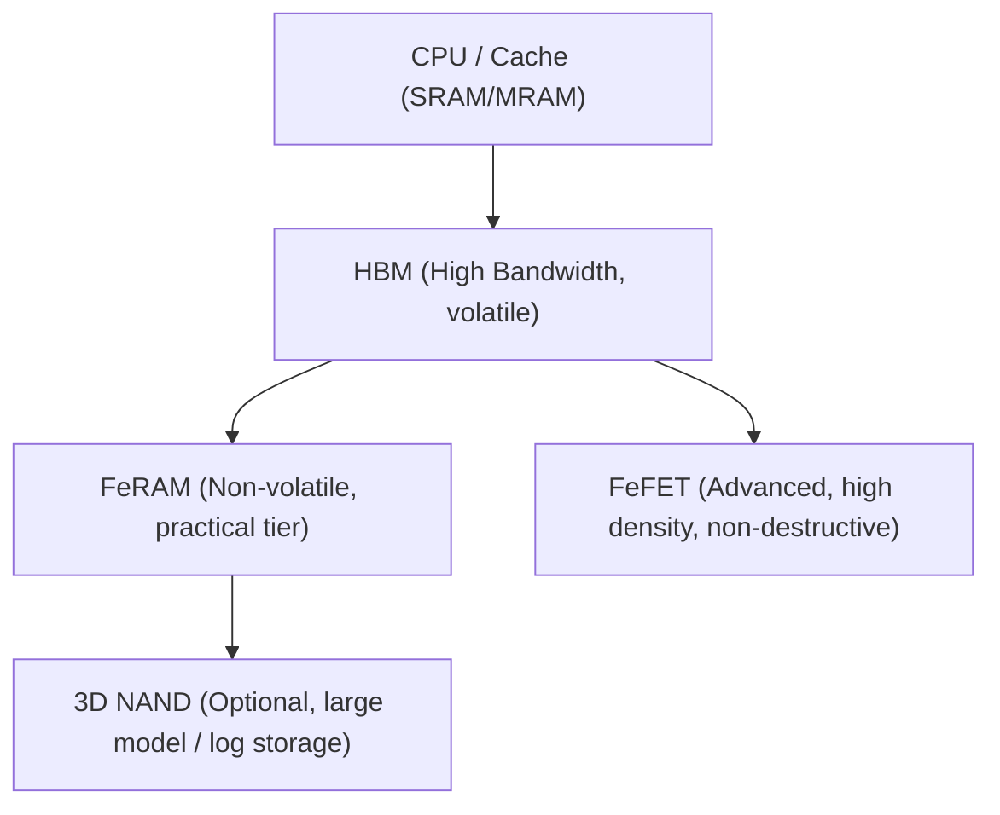

---

# 📘 モバイル用疑似SRAM（VSRAM）技術アーカイブ（2001年）  
*Edusemi-Plus/archive/in2001/VSRAM_2001.md*  
**最終更新 / Last Update: 2025-07-28**

---

## 🧭 概要 / Overview

**日本語**  
本ドキュメントは、2001年に量産された **モバイル用疑似SRAM（VSRAM）** の技術アーカイブである。  
**0.25μm世代の64M DRAM（第3世代）プロセス**をそのまま流用し、内部リフレッシュ制御によってSRAM的に動作。  
この **エプソン製VSRAM** と **シャープ製Flash** を組み合わせたハイブリッドメモリにより、世界初の **カメラ付き携帯電話** が実現した。  

**English**  
This document archives the technology of a **pseudo-SRAM (VSRAM)** product mass-produced in 2001.  
It was based directly on the **0.25 µm 64M DRAM (3rd generation) process**, using internal refresh logic to function like SRAM.  
The combination of **Epson’s VSRAM** and **Sharp’s Flash** hybrid memory enabled the world’s **first camera-equipped mobile phone**.

---

> ⚠️ **免責事項 / Disclaimer**  
> **日本語**：本VSRAM技術は2001年に量産されたもので、2000年代前半に生産終了。後続開発は行われず、現行の事業機密や設計情報は含まれていないため、教育・技術アーカイブ目的での公開に支障はない。  
> **English**: The VSRAM technology documented here was mass-produced in 2001 and discontinued in the early 2000s. No further internal development was pursued. This archive contains no current proprietary information and is released solely for educational and historical purposes.

---

## 1️⃣ 基本構成と特徴 / Architecture and Features

| 要素 / Item | 内容 / Details |
|-------------|----------------|
| プロセス流用 / Process Reuse | **0.25 µm 64M DRAM Gen3セル構造を流用** *Direct reuse of 0.25 µm 64M DRAM Gen3 cell structure* |
| 疑似SRAM動作 / Pseudo-SRAM Function | **内部リフレッシュ制御でSRAM動作を実現** *SRAM-like operation via internal refresh logic* |
| モバイル仕様 / Mobile Features | ・低消費電力設計 ・**標準80 °C保証を90 °Cに拡張** *Low power design, extended temperature range from standard 80 °C DRAM spec to 90 °C* |
| 採用実績 / Adoption | 世界初カメラ付き携帯電話（SHARP製） *Adopted in SHARP’s first camera phone* |

---

## 2️⃣ 初期量産の課題と対策 / Startup Challenges and Solutions

### 2.1 ポーズリフレッシュ不良（高温・長間隔リフレッシュ）  
**Pause Refresh Failures under High Temp / Extended Interval**

| 要素 / Item | 内容 / Details |
|-------------|----------------|
| 問題 / Problem | **90 °C動作（標準80 °C超）**でポーズリフレッシュ時に保持不足発生。主因は**ジャンクションリーク増加**。 *At 90 °C operation, pause refresh retention failure occurred due to increased junction leakage.* |

**対策 / Countermeasures**

| 区分 / Category | 対策 / Measure | 説明 / Description |
|----------------|----------------|--------------------|
| プロセス対策 / Process | **HF洗浄回数の最小化**（WSA後の酸化膜保持） *Minimized HF cleaning post-WSA to preserve oxide* | SNコンタクト部の酸化膜薄化を防ぎ、リークを低減。 *Prevented oxide thinning at SN contacts, reducing leakage.* |
| 電気設定 / Electrical | **バックバイアス強化（Vbs: −1V → −3V）** *Increased back-bias from −1 V to −3 V* | 負バイアス強化でジャンクションリーク抑制。 *Reduced junction leakage via stronger negative body bias.* |

> 🔗 この不良モードは [Bin5: Pause Refresh Fail](../in1998/dram_wafer_test_binclass_0.25um.md) に対応。  
> This failure mode corresponds to [Bin5: Pause Refresh Fail](../in1998/dram_wafer_test_binclass_0.25um.md).

---

### 2.2 ディスターブリフレッシュ不良  
**Disturb Refresh Failures**

| 要素 / Item | 内容 / Details |
|-------------|----------------|
| 問題 / Problem | 0.25 µmのShort Channel Effectによりセル反転（Disturb）発生。80 °Cでは問題化せず、90 °C保証でリーク増大。 *Short-channel effect at 0.25 µm caused cell disturb under 90 °C condition, not significant at 80 °C.* |
| 対策 / Countermeasure | ゲートCD中心値管理を強化し、セル間リークばらつきを抑制。 *Tightened gate CD centering to minimize variation-induced leakage.* |

> 🔗 この不良モードは [Bin6: Disturb Refresh Fail](../in1998/dram_wafer_test_binclass_0.25um.md) に対応。  
> This failure mode corresponds to [Bin6: Disturb Refresh Fail](../in1998/dram_wafer_test_binclass_0.25um.md).

---

## 3️⃣ 次世代VSRAM検討と不採用判断 / Next-Gen VSRAM Evaluation and Rejection

### 3.1 NANYA / 東芝プロセス 0.18 µm VSRAM

| 要素 / Item | 内容 / Details |
|-------------|----------------|
| 評価対象 / Target | NANYA製 0.18 µm DRAM（東芝プロセス） *NANYA/Toshiba 0.18 µm DRAM process* |
| 問題点 / Issues | ・トレンチキャパシタでジャンクション面積増大 ・90 °C保持不足 *Trench capacitor increased junction area; insufficient retention at 90 °C* |
| 結果 / Result | 保持力不足により採用見送り *Rejected due to insufficient retention for mobile spec* |

---

### 3.2 Mosys 1T-SRAM評価（参考）  
**MoSys 1T-SRAM Evaluation (Reference)**

| 要素 / Item | 内容 / Details |
|-------------|----------------|
| 評価対象 / Target | Mosys製 1T-SRAMマクロ *MoSys 1T-SRAM macro* |
| プロセス / Process | 0.18 µm ロジックプロセス *0.18 µm logic process* |
| 特徴 / Features | リフレッシュ不要・DRAMセル不要 *No refresh required, no DRAM cell* |
| 評価状況 / Status | 筆者が他業務（高耐圧インテグレーション）で未完了 *Evaluation not completed due to other assignments* |
| 補足 / Supplement | 📄 [`MoSys_1T_SRAM_Links.md`](./MoSys_1T_SRAM_Links.md) — 外部資料リンク集 *External reference collection* |

---

## 🔮 将来展望 / Future Perspective

**日本語**  
2001年に **VSRAM＋Flash** のハイブリッドが「世界初のカメラ付き携帯電話」を実現したように、  
今後は **HBM＋FeRAM** によるハイブリッドがモバイル／エッジAIの現実解となり、  
さらにアドバンスト形態として **HBM＋FeFET** が登場することで、  
低消費・instant resume・高帯域を兼ね備えた **モバイルエッジAI時代** が到来すると考えられる。  

**English**  
Just as the **VSRAM + Flash** hybrid enabled the first “camera phone” in 2001,  
the **HBM + FeRAM** hybrid will serve as today’s practical solution for mobile/edge AI.  
Looking forward, an **HBM + FeFET** hybrid will emerge as the advanced option,  
combining persistence, instant resume, and high bandwidth to enable the next era of **mobile edge AI**.  

---

### 📊 メモリ技術の進化イメージ / Evolution of Hybrid Memory

上段は「時間軸での技術進化」、下段は「将来想定されるメモリ階層構成」を示す。

---

## 🔗 関連リンク / Related Links

### 📂 64M DRAM 立ち上げ技術アーカイブ（1998年）  
📄 [DRAM_Startup_64M_1998.md](https://samizo-aitl.github.io/Edusemi-Plus/archive/in1998/DRAM_Startup_64M_1998/)  

- 64M DRAM（第3世代 / 0.25 µm）の量産立ち上げ記録。  
  プロセス条件展開、不良解析（Pause Refresh）、ゲート酸化膜ダメージ対策などを収録。  
- *Startup record of 64M DRAM (3rd Gen / 0.25 µm), including process deployment, pause refresh failure analysis, and gate oxide damage mitigation.*  

### 📗 LPDDR+FeRAM（モバイルエッジAI）  
📄 [1_6_lpddr_feram.md](https://samizo-aitl.github.io/Edusemi-v4x/d_chapter1_memory_technologies/1_6_lpddr_feram.html)  

- LPDDR と FeRAM を統合したモバイル/エッジAI向けメモリアーキテクチャ。  
  FEM解析や時系列シーケンスを含み、SystemDK（第2a章）と連携する設計例。  
- *Hybrid memory (LPDDR + FeRAM) for Mobile/Edge AI, including FEM analysis and sequence of operations.*  

### 💾 HBM+FeRAM（モバイルエッジAI）  
📄 [hbm_feram.md](https://samizo-aitl.github.io/Edusemi-v4x/d_chapter1_memory_technologies/hbm_feram.html)  

- **HBM** の広帯域と **FeRAM** の不揮発性を組み合わせ、  
  **モバイルエッジAI** のための統合メモリ構成を解説。  
- *Combines high bandwidth of HBM with non-volatility of FeRAM, proposing an integrated memory architecture for mobile edge AI.*  
