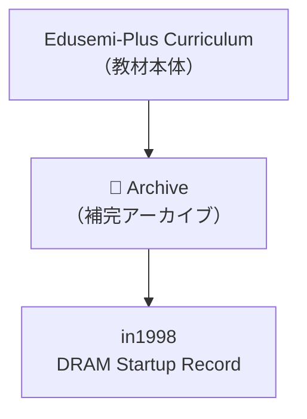

---

# 🗂️ Edusemi-Plus Archive  
**（エデュセミ・プラス 技術アーカイブ）**

> 本ディレクトリは、**Edusemi-Plus教材**を補完する目的で、  
> 半導体技術・設計思想・産業史の文脈における  
> **重要な技術記録・エピソード・ドキュメント**を保存するアーカイブ領域です。  
>
> This directory complements the **Edusemi-Plus curriculum**,  
> serving as an archive for significant **technical records**, **design episodes**, and **industrial documentation**  
> in the context of **semiconductor technology**, **design philosophy**, and **technological history**.

---

## 📘 目的 | Purpose

- **技術史的価値を持つ資料の保管**  
- **体験知・設計思考・工程知識**の記録  
- ChatGPTなどによる**教材生成・プロンプト演習素材**としての活用  

- Preserve materials of **historical and technical significance**  
- Record **tacit knowledge**, **design reasoning**, and **process engineering insights**  
- Enable use as **educational generation and prompt-based exercises** via ChatGPT and related tools

---

## 📂 サブディレクトリ構成 | Directory Structure

| ディレクトリ / Directory | 内容 / Description |
|--------------------------|---------------------|
| [`in1996/`](./in1996/) | 薄膜マイクロリアクトル技術記録（1996–1997年, 信州大学） 📄 [`thinfilm_microreactor.md`](./in1996/thinfilm_microreactor.md) ※フェライト系磁性体 + Alスパイラルコイルを積層したリアクトル構造。500kHz〜1MHzにおけるQ値損失メカニズムとAl/Cu材料選定指針を提示。MAG研究会発表。 *Thin-film microreactor using ferrite + Al spiral coil. Analyzed Q-value loss and proposed Al/Cu material selection based on frequency. Presented at IEEJ MAG 1997.* |
| [`in1998/`](./in1998/) | 64M DRAM立ち上げ記録（1998年, 0.25μm, 三溝真一） 📄 [`DRAM_Startup_64M_1998.md`](./in1998/DRAM_Startup_64M_1998.md) ※本記録は過去の経験に基づく教育記述であり、現行の企業機密には該当しません。 *This archive is based on historical engineering experience and does not contain any proprietary information.* |
| [`in2001/`](./in2001/) | **モバイル用疑似SRAM（VSRAM）技術アーカイブ（2001年, 64M DRAM流用）** 📄 [`VSRAM_2001.md`](./in2001/VSRAM_2001.md) ※**64M DRAM第3世代プロセスを流用し、内部リフレッシュでSRAM的に動作**。世界初の**カメラ付き携帯電話（SHARP製）**に搭載されたモバイルメモリの実体験記録。 *Pseudo-SRAM using 64M DRAM (3rd Gen) process with internal refresh logic. Deployed in SHARP's world-first camera-equipped mobile phone.* |
| `early_PoC/` *(planned)* | 2000年代のPoC設計メモ（予定） Early 2000s PoC design notes |
| `tech_interviews/` *(planned)* | 技術者ヒアリング・設計対話記録（予定） Technical interviews and design dialogues |
| `legacy_nodes/` *(planned)* | レガシーノード（0.35μm〜0.18μm）資料（計画中） Legacy node (0.35μm–0.18μm) process archives |

---

## 🧭 活用方針 | Utilization Policy

- **Edusemi-Plus本編との補完関係を重視**  
- **構造設計 × プロセス設計**の統合的理解を促す教材化  
- 実践現場の**失敗と改善**をケーススタディとして再構成  

- Designed to **complement the main Edusemi-Plus curriculum**  
- Emphasizes the integration of **structural and process design thinking**  
- Reconstructs real-world **failures and improvements** into case-based educational content

---

## 📌 注意事項 | Notes

- 一部資料は **記録途中・未完** の状態で保存されています  
- **企業固有・機密情報は一切含まれていません**  
- `.md → .pdf`, `.zip` 等の形式変換にも対応予定です  

- Some documents are in **draft or in-progress** status  
- No **proprietary or confidential information** is included  
- Format conversion to `.pdf`, `.zip`, etc. is planned as needed

---

### 📊 構造図 | Structure Diagram

---

> このアーカイブは、半導体技術における  
> **「構造と意思決定の記憶」** を未来に残すことを目的としています。  
>
> This archive aims to preserve the **“memory of structure and decision-making”** in semiconductor development.

---

## 👤 **著者・ライセンス | Author & License**

| 📌 項目 / Item | 📄 内容 / Details |
|------|------|
| **著者 / Author** | **三溝 真一**（Shinichi Samizo） |
| **💻 GitHub** |  |
| **📜 ライセンス / License** |  コード / Code: [MIT](https://opensource.org/licenses/MIT) 教材テキスト / Text: [CC BY 4.0](https://creativecommons.org/licenses/by/4.0/) 図表 / Figures: [CC BY-NC 4.0](https://creativecommons.org/licenses/by-nc/4.0/) |

---

## 🔙 戻る / Back
- **JP:** [Edusemi-Plus トップへ戻る](https://samizo-aitl.github.io/Edusemi-Plus/index.html)  
- **EN:** [Return to Edusemi-Plus Top](https://samizo-aitl.github.io/Edusemi-Plus/index.html)
