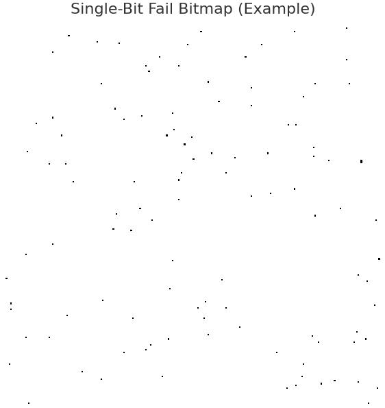
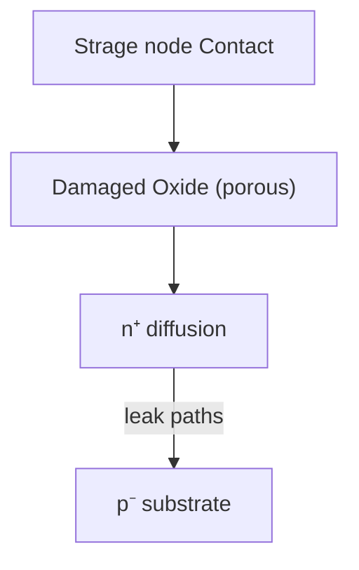

---

# 📘 0.25µm 64M DRAM (3rd Gen) Startup Record (1998)

---

## 1️⃣ プロセス概要 / Process Overview

- **リソグラフィ / Lithography**  
  初の **KrFステッパー** を導入し、0.25µm世代の量産露光技術を確立。  
  *Introduction of KrF stepper, establishing mass-production lithography for the 0.25 µm generation.*

- **デバイス分離 / Device Isolation**  
  **Semi-recess LOCOS** による素子分離。  
  *Isolation by semi-recess LOCOS.*

- **ウェル構成 / Well Structure**  
  **Triple-well** + **Deep N-Well** によりセル耐ノイズ性を強化。  
  *Triple-well and deep N-well improved cell noise immunity.*

- **ゲート電極 / Gate Electrode (Word Line)**  
  - **Wシリサイド (WSi, CVD)** を採用。  
  - **BRAC (Barrier Cap) 層**によりエッチング耐性と絶縁性を確保。  
  - **ビットラインコンタクトがワードラインと接触しないセルフアライン構造**を実現。  
  *WSi (CVD) gate with BRAC layer enabled self-aligned structure avoiding contact short.*

- **ビットライン / Bit Line**  
  - **コンタクトと配線を同時形成**し、WSi-CVDにより抵抗を低減。  
  - 高密度配線を実現。  
  *Simultaneous contact + wiring formation with WSi-CVD reduced resistance, enabling high-density layout.*

- **ストレージノード / Storage Node (Capacitor)**  
  - スタック型構造。  
  - 粗面化処理で容量を **1.5–1.8倍** に増強。  
  *Stacked capacitor with roughened surface increased capacitance by 1.5–1.8×.*

- **配線・封止 / Metallization & Passivation**  
  - **AlCu/TiN配線、SOG平坦化、SiN/PIパッシベーション**。  
  *AlCu/TiN wiring, SOG planarization, and SiN/PI passivation.*

---

## 2️⃣ 立ち上げ方法 / Ramp-up Method

### (A) ベースフロー / Standard Flow

| フェーズ | 日本語説明 | English Explanation |
|----------|------------|----------------------|
| **SCF (Short Cycle Feedback)** | 立ち上げ仕様に基づき短サイクルロットを流して条件を迅速評価・修正。 | Short-cycle lots used for fast evaluation and recipe tuning. |
| **形状ロット (≈10 lots)** | 実製品ウエハを用いて寸法変換差や膜堆積を評価。要素技術部門に供給。 | Shape lots verified CD, etch transfer, and film properties; distributed to element teams. |
| **本番ロット** | 信頼性確認用。ウェハテストと長期信頼性試験で量産可否を判断。 | Reliability-confirmation lots for wafer test and burn-in qualification. |

---

### (B) 実務フロー（筆者担当） / Practical Workflow (Author’s Role)

1. **条件データ受領 / Data Import**  
   移管元（三菱KD工場）から **フロッピー2枚分の処理条件** を受領。  
   *Received 2 floppy disks of process conditions from Mitsubishi KD Fab.*

2. **条件展開 / Dissemination**  
   各要素技術部門（拡散・CVD・PVD・エッチング）へ展開。  
   *Distributed conditions to element process teams.*

3. **各工程SCF / SCF at Each Step**  
   条件を試行 → 修正 → 再投入の繰り返し。  
   *Iterative short-cycle testing and corrections.*

4. **電子流動票作成 / Electronic Flow Sheet**  
   各条件を集約し最新レシピを反映。  
   *Compiled conditions into electronic traveler sheet.*

5. **形状ロット投入 (10 lots)**  
   寸法確認・断面観察・レシピ更新を実施。  
   *Executed shape lots for CD, cross-sections, and recipe update.*

6. **形状Fix / Shape Fix**  
   寸法・膜厚が狙い値に到達した時点で確定。  
   *Finalized recipe upon achieving target specs.*

7. **本番ロット投入 (5 lots)**  
   信頼性試験を経て量産移行を判断。  
   *Final reliability-confirmation lots enabled mass production.*

---

## 3️⃣ 運用体制 / Operational Framework

- 通常：ロットは **自動搬送システム**（ストッカー＋リムライナー）で搬送 → 遅延発生。  
- 改善：初回ロットは **手渡し流動 (manual carry)** を採用し、担当者が装置前で待機し即処理。  
- 効果：搬送待ちロスを最小化し、初回ロットを短時間で流動。  

📌 **全体体制**  
- 技術部門（プロセス開発・要素技術・立ち上げチーム）が **日勤＋夜勤の二交代制**で常駐。  
- **毎朝の朝会**で進捗を「見える化」：  
  - 流動票をラミネート掲示  
  - 遅延日数を明示  
  - 各要素技術担当の進捗を共有  

*By adopting manual lot transfer and 24/7 cross-functional monitoring, ramp-up was accelerated and bottlenecks were minimized.*

---

## 4️⃣ 不良解析と改善プロセス / Failure Analysis & Improvement

### (1) 現状把握 / Initial Findings

- **初期歩留まり / Initial Yield**：≈65%  
- **支配的不良モード / Dominant Failure Mode**：Pause Refresh Fail (Bin5)  
- **不良分布 / Failure Distribution**：ウエハ面内に単ビットエラーが均一散在。ライン欠陥なし。  
- **評価結果 / Evaluation**：寸法・容量・断面観察は正常範囲内。  

     

➡️ **「観察上は健全だが保持特性劣化を招くセンシティブ不具合」**と推定。  
➡️ *Yield loss caused by invisible, retention-degrading defects.*

---

### (2) 仮説モデル / Hypothesized Model

- **真因候補 / Root Cause Candidate**：  
  **ストレージノードコンタクト n⁺/p⁻ ジャンクションのリーク増大**。  
- **メカニズム / Mechanism**：  
  - LDD形成時、**ゲート酸化膜残渣が複数回のアッシングでプラズマダメージ**を受ける。  
  - 酸化膜がポーラス化 → 拡散層に微細リークパス形成。  
- **現象整合性 / Consistency**：  
  - ランダム単ビット不良、SEM異常なし。  
  - リークのみが顕在化。
 

➡️ **「不可視のプラズマダメージによるジャンクションリーク」**と結論。  
➡️ *Postulated root cause: plasma-induced junction leakage.*

---

### (3) 対策立案 / Countermeasure

- **方針 / Policy**：アッシング工程のプラズマ曝露を最小化。  
- **具体策 / Action**：  
  - LDD工程のレジスト剥離を **プラズマアッシング → ウェット処理（硫酸系）** に切替。  
- **狙い / Aim**：  
  - プラズマ起因の酸化膜ダメージを根本排除。  
  - ジャンクションリーク発生を防止。  

---

### (4) 効果検証 / Verification

- **歩留まり改善 / Yield Gain**：  
  - Before ≈65% → After ≈**80%**  
- **信頼性評価 / Reliability**：  
  - 高温動作・保持試験・バーンインで規格クリア。  
- **量産適用 / Mass Production**：  
  - 改善条件を最終レシピに反映し安定量産を確立。  

➡️ **「解析 → 仮説 → 対策 → 効果確認」の改善サイクルにより、センシティブ不良を克服し量産条件を確立。**  
➡️ *Closed improvement loop enabled stable high-yield production.*
