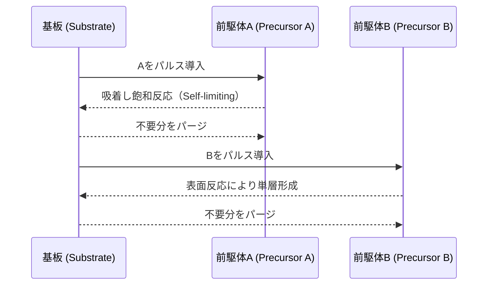

# 🧪 ALD（原子層堆積法）の基礎と装置構造 | Atomic Layer Deposition Mechanism

本ページでは、ALD（Atomic Layer Deposition）の原理、プロセス構成、装置の特徴について解説します。  
This page introduces the principles, process flow, and tool architecture of Atomic Layer Deposition (ALD).

---

## 🌐 ALDとは何か | What is ALD?

ALDは、原子レベルで制御された薄膜形成技術であり、絶縁膜、ゲート酸化膜、バリア膜などの形成に広く用いられます。  
ALD is a thin film deposition method enabling atomic-level thickness control, widely used for dielectrics, gate oxides, and barrier layers.

- **1回のサイクルで1原子層ずつ積層**  
  Deposits one atomic layer per cycle  
- **表面反応に基づく自己制御型プロセス**  
  Self-limiting surface reactions ensure high uniformity  
- **3D構造・高アスペクト比への高い被覆性**  
  Excellent conformality for 3D and high aspect ratio structures

---

## ⚙️ プロセスの流れ | Typical ALD Cycle

1. **Precursor A 導入 → 吸着飽和**  
2. **パージで余剰反応物除去**  
3. **Precursor B 導入 → 表面反応による層形成**  
4. **再度パージ → 1原子層の堆積完了**

---

## 🏭 代表装置メーカーと用途 | Major Vendors & Applications

| メーカー | 用途 | 備考 |
|----------|------|------|
| Applied Materials 🇺🇸 | High-k膜、ゲート絶縁膜 | 高速ロジック向け |
| Tokyo Electron (TEL) 🇯🇵 | バリア膜、封止膜 | Cu配線、3D NAND |
| Lam Research 🇺🇸 | 3Dデバイス対応ALD | 高アスペクト構造用 |
| ASM International 🇳🇱 | ALD専業で先駆 | 原子層精度で高評価 |

---

## 🔗 他工程との関係 | Relation to Other Processes

- **CVDとの違い**：CVDは連続反応、ALDはパルス制御と表面反応でより精密  
  ALD differs from CVD by using surface-limited, pulsed reactions  
- **エッチングとの連携**：ALDで形成した膜がドライエッチング耐性に影響  
  ALD films affect etch selectivity and process stability  
- **リソグラフィ保護膜**：EUVプロセスでは保護膜としてALDが重要  
  Used for pattern protection in EUV lithography flows

---

## 🧠 学習のヒント | Learning Suggestions

- **ALD vs CVDの成膜制御性と構造均一性を比較してみよう**  
  Compare ALD and CVD in terms of thickness control and uniformity  
- **原子層レベルの制御が必要な場面を見つけよう（例：FinFET）**  
  Identify use-cases that demand atomic-scale precision (e.g., FinFETs)  
- **装置構成（チャンバー、バルブ、パージ系）を図解してみよう**  
  Draw diagrams of ALD tool components: chamber, valves, purge lines

---

## 📎 関連カテゴリ | Related Categories

- `🧪 front-materials/`：ALD用前駆体と基板材料
- `⚙️ front-end-tools/`：他の成膜装置との比較
- `🧼 dry-etching/`：エッチングとの相互関係

---

## 📄 ライセンス | License

本資料はMIT Licenseに基づき、非営利・教育目的での自由な利用・改変・共有を歓迎します。  
This content is released under the MIT License for free non-commercial educational reuse.

---

ALDは、次世代の3D構造や微細デバイスの形成に不可欠な技術です。プロセス制御と装置構造を理解し、設計・製造との統合を意識して学びましょう。  
ALD is indispensable for advanced 3D structures and nano-scale devices. Understanding its mechanisms fosters better integration with design and manufacturing.
