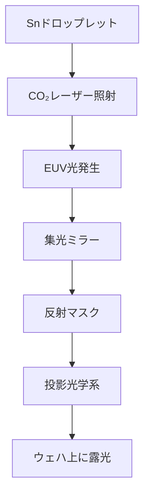

---

# 🔭 ASMLのEUV露光装置機構｜Extreme Ultraviolet Lithography by ASML

本ページでは、ASML社のEUV（Extreme Ultraviolet）露光装置の機構とその構成要素について解説します。  
This page explains the structure and key components of ASML's EUV lithography system.

---

## 🌐 背景と重要性 | Background & Importance

EUV露光は13.5nmの極端紫外線を用いたリソグラフィ技術で、7nm世代以降のロジック/メモリ半導体製造に不可欠です。  
EUV lithography, using 13.5nm wavelength light, is essential for advanced nodes (7nm and beyond) in logic and memory chip manufacturing.

- 短波長により、1Xnm以下のパターン形成が可能  
  Enables sub-10nm patterning due to its short wavelength  
- 高NA化（Numerical Aperture）による解像度向上が進行中  
  High-NA versions are under development for further resolution gain

---

## 🧩 装置の主構成 | Key Components of EUV System

| 機能 | 構成要素 | 説明（日本語） | Description (English) |
|------|-----------|------------------|-------------------------|
| 光源 | Snプラズマ発生装置 | CO₂レーザーがSnドロップレットを照射しEUVを生成 | CO₂ laser hits Sn droplets to generate EUV light |
| 収束・整形 | 集光ミラー（Collector） | 放射状に広がるEUV光を平行ビーム化 | Converts diverging EUV into usable beam |
| マスク系 | EUV反射マスク（レチクル） | 透過ではなく反射型で構成される4:1縮小マスク | Reflective mask with 4:1 reduction |
| 投影系 | Bragg多層ミラー | Mo/Si多層構造で高反射率を実現 | Multilayer mirrors reflect EUV efficiently |
| 環境制御 | 真空チャンバー | EUV光は空気中で吸収されるため全系真空化 | Entire optical path is under vacuum |

---

## 🔄 EUVプロセスの流れ | EUV Lithography Workflow

---

## ⚙️ 技術的課題と連携装置 | Technical Challenges & Linked Tools

- **EUVレジストの感度・エッチング耐性のバランス**  
  Balancing resist sensitivity and etch durability  
- **メトロロジ・欠陥検査との連携（Actinic Inspection等）**  
  Integrated metrology and defect inspection (e.g., actinic tools)  
- **成膜・アッシングとのプロセス整合性**  
  Process integration with deposition, ashing, and cleaning  

---

## 🏢 ASMLの装置シリーズ | ASML EUV Tool Series

| モデル | 用途 | 特徴 |
|--------|------|------|
| NXE:3400C | 7nm量産対応 | 世界初の量産EUV装置 |
| NXE:3600D | 5nm〜3nm対応 | さらなるスループット・精度 |
| EXE:5000シリーズ | High-NA EUV | NA=0.55で次世代ノード対応 |

---

## 🧠 学習のヒント | Learning Suggestions

- Braggミラーの構造と反射機構を調べてみよう  
  Study how Bragg mirrors reflect EUV light  
- EUV装置とメトロロジ装置のデータ連携を図解してみよう  
  Visualize data integration between EUV and metrology tools  
- EUV用マスクの製造プロセス（EUV mask blank）を調査しよう  
  Investigate EUV mask fabrication processes  

---

## 📎 関連カテゴリ | Related Categories

- `🖼️ photomasks/`：EUV対応マスク技術  
- `🔬 metrology-tools/`：欠陥検査・EUVパターン測定  
- `🧪 front-materials/`：EUVレジスト材料やミラー材料  

---

## 📄 ライセンス | License

本資料はMIT Licenseに基づき、非営利・教育目的での自由な利用・改変・共有を歓迎します。  
This content is released under the MIT License for free non-commercial educational reuse.

---

EUV露光技術は、半導体微細化の核心に位置する革新技術です。ASMLの装置構成と物理原理を深く理解することで、プロセス統合や設計との橋渡しが可能となります。  
EUV technology is at the core of semiconductor scaling. A deep understanding of ASML's system architecture and optics enables better process integration and design insight.
