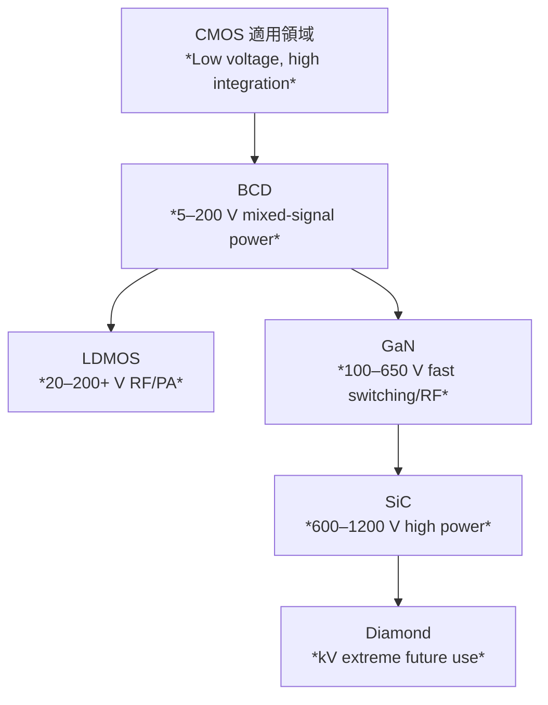
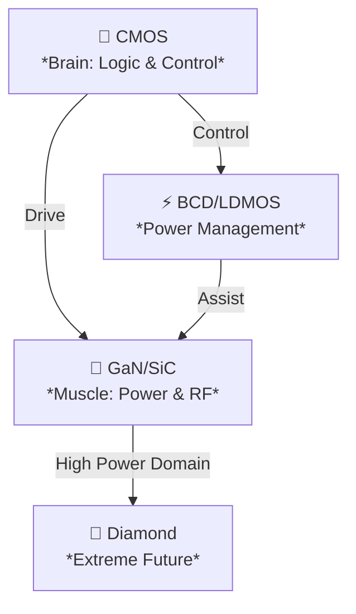
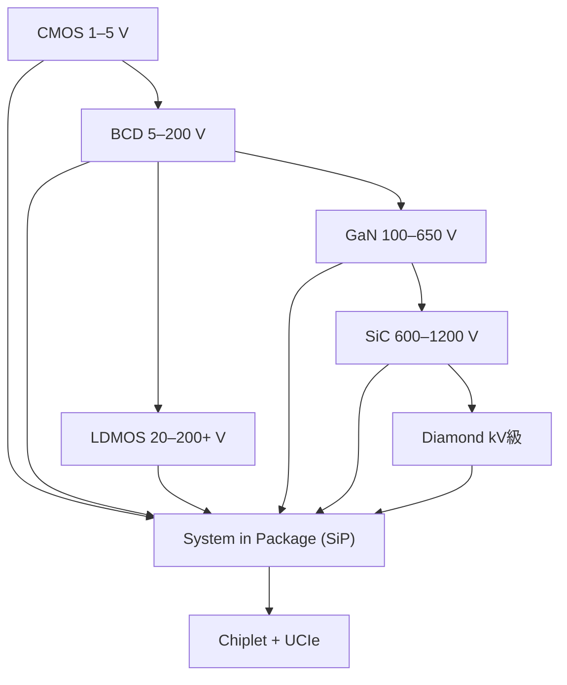
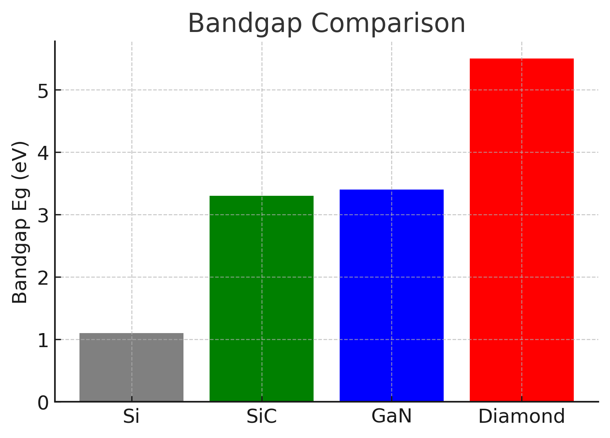
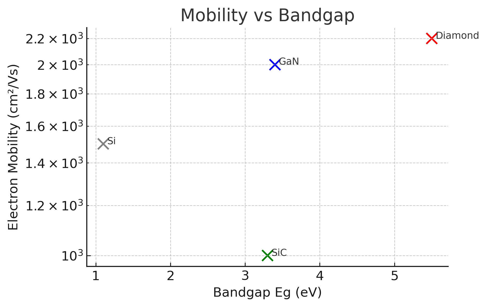
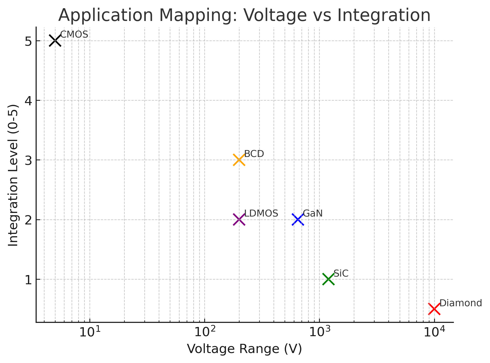

---

# 📘 CMOS適用限界とWBGへの分岐まとめ  
*Where CMOS ends and WBG (SiC / GaN / Diamond) begins*

---

## ✅ 電圧・用途の棲み分け | Voltage & Application Mapping

| 技術 / Technology | 耐圧レンジ（目安） / *Voltage Range* | 集積度 / *Integration* | 主な強み / *Strengths* | 適用分野 / *Applications* |
|------|----------------------|------------|-------------------|----------------|
| **CMOS** | 1–5 V（ロジック回路） *Logic level* | ⭐⭐⭐⭐⭐ 高 / *High* | **高集積・低消費電力** *High density, low power* | CPU, GPU, DRAM, SoC |
| **BCD** | 5–200 V | ⭐⭐⭐ 中 / *Medium* | **デジタル＋アナログ＋中耐圧を1チップ化** *Mixed-signal + power integration* | PMIC, 車載IC, モータードライバ |
| **LDMOS** | 20–200+ V | ⭐⭐ 低 / *Low* | **中耐圧・高出力・RF対応** *Medium voltage, high power, RF capable* | 基地局PA, 車載電源 |
| **SiC** | 600–1200 V+ | ⭐ 低 / *Low* | **高耐圧・高温・高効率** *High voltage, high temperature, efficiency* | EVインバータ, 産業電源 |
| **GaN** | 100–650 V（RF:〜100 GHz） | ⭐⭐ 低 / *Low* | **高速スイッチング・高周波・小型化** *Fast switching, RF, compact* | 充電器, サーバ電源, 5G基地局, レーダー |
| **Diamond** | kV〜10kV級（研究段階） | ☆ 非常に低 / *Very low* | **超高熱伝導・超高耐圧（理論最強）** *Ultra-high thermal & breakdown* | 宇宙, 核融合, 将来応用 |

---

## 📊 適用領域イメージ | Application Landscape

---

## 🔀 選定フロー | Selection Flow

1. **SoC集積が必須？**  
   *Is SoC integration required?*  
   → はい → **CMOS / BCD**

2. **耐圧 > 200 V 必要？**  
   *Need >200 V blocking voltage?*  
   → はい → **LDMOS / GaN / SiC**

3. **> 600 V必要？**  
   *Need >600 V?*  
   → はい → **SiC**（さらにkV級なら Diamond / Ga₂O₃）

4. **高周波・RF用途？**  
   *RF or high-frequency application?*  
   → はい → **GaN**（特に *GaN on SiC*）

---

## 🎯 まとめ | Summary

- **CMOSの限界 = 数十V以下、SoCやロジック領域**  
  *CMOS limit ≈ under tens of volts, for logic/SoC*  
- **数十V〜200V → BCD / LDMOS** が適用範囲  
  *Medium voltage handled by BCD/LDMOS*  
- **200〜650V → GaN** が有利（電源小型化・RF高効率）  
  *GaN dominates mid-voltage & RF power*  
- **600V超 → SiC** が本命  
  *SiC leads in high-voltage & power electronics*  
- **kV級・極限環境 → Diamond（研究段階）**  
  *Diamond for extreme and future applications*

---

## 🧩 System in Package 視点 | SiP Perspective

**単一プロセスでは全領域をカバーできないため、実際の応用は「System in Package (SiP)」で複数チップを組み合わせるのが主流**です。  
*Since no single process covers all domains, practical applications rely on System in Package (SiP) combining multiple dies.*

### 🔹 役割分担 | Role Sharing
- **CMOS** → 制御・ロジック・インターフェース  
  *Logic, control, interface*  
- **BCD / LDMOS** → 電源管理・中耐圧駆動  
  *Power management, medium-voltage driving*  
- **GaN / SiC** → 高耐圧・高効率のパワー変換  
  *High-voltage, high-efficiency power conversion*  
- **Diamond**（将来）→ 超高耐圧・放熱の極限用途  
  *Future: extreme high-voltage & thermal handling*  

### 🔹 実例 | Practical Examples
- 📱 **スマホPMIC**：CMOS制御 + BCD電源 + LDMOSスイッチ  
  *Smartphone PMIC: CMOS logic + BCD power + LDMOS switch*  
- 🚗 **EVインバータ**：SiC MOSFET + CMOSゲートドライバ  
  *EV inverter: SiC MOSFET + CMOS gate driver*  
- 📡 **5G基地局PA**：GaN HEMT + CMOS制御回路  
  *5G base-station PA: GaN HEMT + CMOS control*  

---

## 🖼️ 見取り図 | Technology Integration Landscape

### 📊 図1: 概念モデル | Conceptual Model  
**CMOS = 🧠 Brain（制御・ロジック）**  
**WBG (GaN/SiC) = 💪 Muscle（パワー・RF）**

### 📊 図2: 技術マップ | Voltage & Application Landscape

---

## 🖼️ 付録: 材料特性グラフ | Appendix: Material Property Charts

### バンドギャップ比較 | Bandgap Comparison
<picture>
  <source srcset="{{ '/materials/images/bandgap_comparison.png' | relative_url }}">
  
</picture>
*Eg values for Si, SiC, GaN, Diamond*

### 移動度 vs Eg グラフ | Mobility vs Bandgap
<picture>
  <source srcset="{{ '/materials/images/mobility_vs_bandgap.png' | relative_url }}">
  
</picture>
*Trade-off between carrier mobility and bandgap*

### 応用マップ | Application Mapping
<picture>
  <source srcset="{{ '/materials/images/application_mapping.png' | relative_url }}">
  
</picture>
*Voltage range vs Integration landscape*
