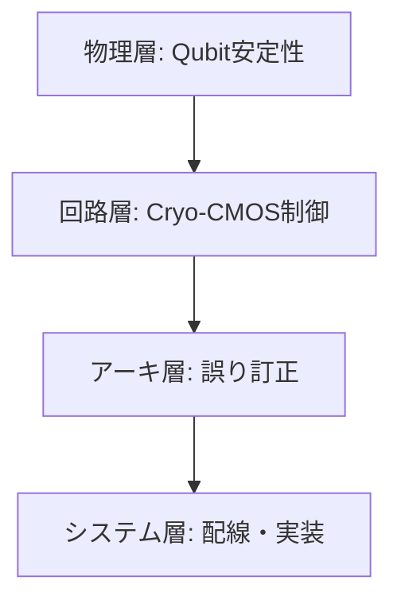

# 5. Cross-Layer Challenges

量子半導体はデバイス単体としての動作だけでなく、**物理層からシステム層に至る多層課題 (Cross-Layer Challenges)** に直面している。  
本章では誤差・デコヒーレンス、誤り訂正、Cryo-CMOS、配線・相互接続といった観点を整理する。

---

## 5.1 誤差とデコヒーレンス

Qubitは外部環境との相互作用に極めて敏感であり、コヒーレンス時間 $T_2$ が計算能力を制限する。  

- **縦緩和 (Relaxation)**: $T_1$  
- **横緩和 (Dephasing)**: $T_2$

一般に $T_2 \leq 2T_1$ が成り立つ。

$$
\frac{1}{T_2} = \frac{1}{2T_1} + \frac{1}{T_\phi}
$$

ここで $T_\phi$ は純粋脱相関時間。  
量子計算の安定性は $T_2$ に大きく依存する。

---

## 5.2 誤り訂正 (Quantum Error Correction)

量子状態は壊れやすいため、**誤り訂正符号 (QEC)** が必須となる。  
代表例は **Shor符号** や **表面コード (Surface Code)**。  

論理Qubitあたりに必要な物理Qubit数 $N_{phys}$ は誤り率 $p$ に反比例して急増する。

$$
N_{phys} \propto \frac{1}{p^2}
$$

例: エラー率 $p = 10^{-3}$ で論理Qubitを安定化させるには、数百～数千の物理Qubitが必要。

---

## 5.3 Cryo-CMOS

- 量子チップは極低温 (10–20 mK) で動作するため、制御回路もCryo環境で動作する必要がある。  
- **Cryo-CMOS** は 4 K 以下でのトランジスタ動作を保証する設計。  
- 教育的観点では「制御ICも半導体技術で支える」という点を強調できる。  

数式的にはMOSFETのサブスレッショルド電流 $I_{sub}$ は温度依存性を持つ：

$$
I_{sub} \propto e^{-\frac{V_{th}}{n (kT/q)}}
$$

低温 ($T \to 0$) では理想に近い特性が得られるが、しきい値シフトやフリッカーノイズが課題となる。

---

## 5.4 相互接続と配線

量子回路のスケーリングでは「配線の制約」が深刻化する。  

- 数千Qubitスケールでは制御線・読み出し線の本数が膨大になる。  
- 配線遅延・クロストーク・Cryo環境での熱流入が問題となる。  

教育的には「古典CMOSの配線遅延問題」との類似性を学習させることができる。

---

## 5.5 教材的整理

### Cross-Layer課題の階層構造

演習課題例
	1.	$T_2$ と $T_1$ の関係式から、量子計算における制約を議論せよ。
	2.	誤り率 $p=10^{-3}$ のとき、論理Qubitに必要な物理Qubit数を推定せよ。
	3.	Cryo-CMOSにおける温度依存特性を古典CMOSと比較せよ。

