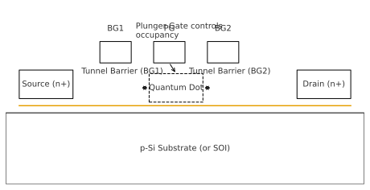

# 02｜Device Design / デバイス設計

---

## 2.1 設計方針 / Design Concept
- 本研究では **0.18 µm CMOSプロセス**を利用し、ゲート電極によってシリコン量子ドットを形成する。  
- 基本的なアイデアは、**複数のゲート電極を用いて電子の閉じ込め領域を制御すること**にある。  
- 従来のMOSFET構造を拡張し、**ソース・ドレイン間に人工的なポテンシャル井戸**を作る。  

---

## 2.2 デバイス構造 / Device Structure
- **基板**: p型シリコン基板、またはSOI (Silicon-on-Insulator)。  
- **ゲート酸化膜**: SiO₂ (厚さ 5–10 nm 程度)。  
- **ゲート電極**: ポリSiまたは金属ゲートを用い、複数本を並列に配置。  
- **ソース/ドレイン**: n+拡散層として形成。  

### 特徴
- 中央のゲート電極が **量子ドットの閉じ込め領域**を定義。  
- 両端のゲート電極は **トンネルバリア**として機能。  
- ゲート電圧の組み合わせにより、ドット内の電子数を制御可能。  

  
*図2-1｜0.18 µm CMOSゲートパターンを用いたシリコン量子ドット模式図 / Schematic of a silicon quantum dot defined by 0.18 µm CMOS gates.*

---

## 2.3 ゲートパターン設計 / Gate Layout
- 設計ルール：**0.18 µm CMOS PDK**に準拠。  
- 配置の例:  
  - **Barrier Gate (BG1, BG2)** : 電子のトンネルバリアを形成。  
  - **Plunger Gate (PG)** : ドット内部の電子数を調整。  
  - **Screening Gate** : 電場シールド用に配置する場合あり。  

> イメージ図（後で追加予定）  
> ```
> Source ——[ BG1 ]——[ PG ]——[ BG2 ]—— Drain
> ```
> - BG1/BG2: バリア制御ゲート  
> - PG: プランジャーゲート  

---

## 2.4 シミュレーション計画 / Simulation Plan
- **TCAD (Sentaurus, Silvaco)** でポテンシャル分布を解析。  
- **SPICE**でMOSキャパシタ・MOSFETモデルを用いたI–V特性を事前評価。  
- 温度依存性を加えて **Cryo環境での動作**を模擬。  

---

## 2.5 設計上の課題 / Design Challenges
- CMOS標準プロセスでは、必ずしも量子ドット形成が保証されない。  
- **ゲート電圧の調整幅**が限られているため、閉じ込め領域の制御精度が課題。  
- **ばらつき（デバイス寸法、ドーピング濃度）**が量子特性に大きく影響。  

---
