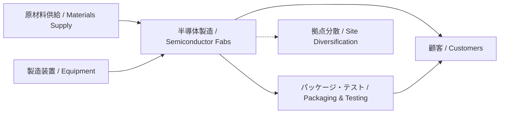

---

# 🌏 2.4 サプライチェーンの地政学的分散と拠点戦略  
**Geopolitical Diversification of Supply Chains**

---

## 📜 背景 / Background

半導体の製造サプライチェーンは、原材料、装置、設計IPから最終製造まで**グローバル分業**が進んでいます。  
しかし、パンデミックや米中対立、台湾有事リスクなどにより、**拠点の分散化と多元化**が急務となっています。

The semiconductor supply chain spans raw materials, equipment, design IP, and final manufacturing across a **globally distributed system**.  
However, recent shocks such as the pandemic, the U.S.–China rivalry, and Taiwan contingency risks have made **diversification and redundancy** urgent priorities.

---

## 🌐 拠点分散の主な動機 / Key Drivers for Diversification

| 要因 / Factor | 内容 / Details | 影響 / Impact |
|---------------|----------------|---------------|
| 地政学リスク | 台湾海峡危機、米中摩擦 | 特定地域依存の回避 |
| 災害リスク | 地震、洪水、停電 | 生産停止のリスク低減 |
| サプライ安定 | 部材供給の確保 | リードタイム短縮 |
| 顧客要求 | ローカル生産志向 | ESG・規制対応 |

---

## 🏭 分散戦略の例 / Examples of Diversification Strategies

1. **多国間Fab展開** — 米国（アリゾナ）、日本（熊本）、欧州（ドイツ）への拠点設置  
   Multi-national fab deployment: U.S. (Arizona), Japan (Kumamoto), Europe (Germany)  
2. **複数サプライヤー契約** — 部材や装置の複数ソース化  
   Multiple sourcing for materials and equipment  
3. **パッケージ・テストの海外展開** — OSAT拠点をASE, Amkorなどと連携  
   Overseas OSAT expansion in collaboration with ASE, Amkor  

---

## 📊 サプライチェーン分散モデル / Supply Chain Diversification Model

---

## 📚 用語集 / Glossary
- **OSAT** — Outsourced Semiconductor Assembly and Test  
- **Multi-sourcing** — 複数供給元戦略  
- **Business Continuity Plan (BCP)** — 事業継続計画  

---

## 📝 まとめ / Summary
サプライチェーンの地政学的分散は、単なる生産効率化ではなく、**リスクマネジメントの核心**です。  
特にTSMCのような先端ファウンドリにとって、拠点多様化は**経済安全保障戦略そのもの**となっています。

Geopolitical diversification of supply chains is not just about efficiency but is a **core element of risk management**.  
For leading foundries like TSMC, site diversification is **a direct extension of economic security policy**.

---

## 🔗 前後リンク / Navigation
- **◀ 前節 / Previous**: [2.3 CHIPS法と日米台連携](2_3_chips_act_japan_us_taiwan.md)  
- **▶ 次節 / Next**: [2.5 台湾有事リスクと経済安全保障政策](2_5_taiwan_contingency.md)  
- **🏠 第2章トップ / Chapter 2 Top**: [README](../README.md)
