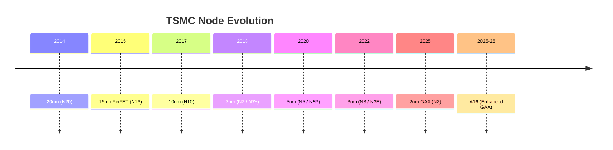

---

# 📏 1.1｜ノード年表とマーケティング命名の差異  
**1.1｜Node Timeline & Marketing Name Differences**

## 📝 概要 / Overview

**JP:**  
半導体業界で使われる「5nm」「3nm」などのノード名称は、かつてはゲート長や配線ピッチなどの物理寸法を指していましたが、2010年代以降は**マーケティング色が強まり、必ずしも物理寸法を反映しないラベル**となっています。TSMCも例外ではなく、内部での正式呼称（N5、N3、N2など）と市場向けの呼び方に差異があります。

**EN:**  
In the semiconductor industry, node names such as "5nm" or "3nm" once referred to physical dimensions like gate length or metal pitch. Since the 2010s, these labels have become **marketing-oriented and no longer directly represent physical dimensions**. TSMC is no exception—its internal designations (N5, N3, N2, etc.) differ from the marketing names used in public.

---

## 📅 ノード年表 / Node Timeline

| 年 / Year | マーケティング名称 / Marketing Name | 内部呼称 / Internal Label | 主な特徴 / Key Features |
|-----------|------------------------------------|---------------------------|--------------------------|
| 2014 | 20nm | N20 | 最後のプレFinFETノード / Last pre-FinFET node |
| 2015 | 16nm | N16 / N16FF | 初のFinFET採用 / First FinFET adoption |
| 2017 | 10nm | N10 | 高密度ロジックだが短命ノード / High-density but short-lived node |
| 2018 | 7nm | N7 / N7+ | DUV多重パタ＋一部EUV / DUV multi-patterning + partial EUV |
| 2020 | 5nm | N5 / N5P | 本格EUV導入 / Full EUV adoption |
| 2022–23 | 3nm | N3 / N3E | 改良FinFET、EUV層数増加 / Enhanced FinFET, more EUV layers |
| 2025 (予定) | 2nm | N2 | GAAナノシート構造 / GAA nanosheet structure |
| 2025–26 (予定) | A16 | A16 | GAA強化版、チップレット前提設計 / Enhanced GAA, chiplet-ready design |

---

## 🔍 命名の差異 / Naming Differences

**JP:**  
- **内部呼称（例：N5）**はプロセス技術世代を明確化するためのTSMC社内基準。  
- **マーケティング名称（例：5nm）**は他社との比較や顧客向けアピール目的。  
- 同じ「5nm」でも、TSMCとSamsungでは実効密度や配線寸法が異なる。  

**EN:**  
- **Internal labels** (e.g., N5) are TSMC's in-house standard to define process generations.  
- **Marketing names** (e.g., 5nm) are for competitive positioning and customer communication.  
- The same "5nm" can differ in actual density and metal pitch between TSMC and Samsung.

---

## 🖼 ノード進化年表（概念図） / Node Evolution Timeline (Concept)

---

## 📎 関連リンク / Related Links

- [TSMC公式プロセス技術ページ / Official Process Technology Page](https://www.tsmc.com/english/dedicatedFoundry/technology)

---

## 📅 更新履歴 / Update History

| 日付 / Date | 内容 / Details |
|-------------|----------------|
| 2025-08-11 | 初版作成（英日併記、年表・図追加） / First edition with JP/EN text, timeline table, and diagram |

---

## 🔙 ナビゲーション / Navigation
- **前節 / Previous:** *なし*（This is the first section）  
- **次節 / Next:** [1.2｜FinFET技術の確立と5nm世代までの設計手法 / FinFET Establishment & Design up to 5nm](1_2_finfet_to_5nm.md)  
- **章トップ / Chapter Top:** [第1章 README](../README.md)
