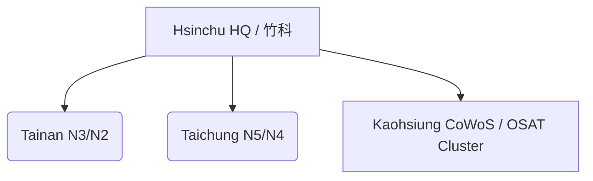

File: e_chapter2_geopolitics/2_1_taiwan_tsmc_dependency.md
---
layout: default
title: 🌏 2.1 台湾の戦略的位置づけとTSMCの依存構造 / Strategic Role of Taiwan and TSMC's Dependency Structure
---

# 🌏 2.1 台湾の戦略的位置づけとTSMCの依存構造  
**Strategic Role of Taiwan and TSMC's Dependency Structure**

---

## 📜 背景 / Background

台湾は、世界半導体ファウンドリ市場の**約60%**を占めるTSMCを擁し、  
その先端製造能力は**7nm世代以降で事実上の独占状態**にあります。  
地政学的には、中国大陸からわずか160kmの台湾海峡を隔てた位置にあり、  
米中対立の最前線に立つ戦略的拠点です。

Taiwan hosts TSMC, holding **around 60%** of the global foundry market share,  
with near-monopoly status in **7nm and beyond** advanced manufacturing.  
Geopolitically, it sits just 160 km across the Taiwan Strait from mainland China,  
making it a strategic hotspot in the U.S.–China rivalry.

---

## 🔍 詳細分析 / Detailed Analysis

### 1) 地理的優位とリスク / Geographic Advantage & Risk
- **優位**: 台湾はアジアの海上交通路と製造クラスターの中心に位置。  
- **リスク**: 台湾有事が現実化すれば、世界の半導体供給網に甚大な影響。

**Advantage**: Central location in Asia’s shipping lanes and manufacturing clusters.  
**Risk**: Any Taiwan contingency would severely disrupt global semiconductor supply.

---

### 2) 技術的集中 / Technological Concentration
- 先端ノード（N3, N2）の生産能力は台湾国内Fabに集中。  
- CoWoS・InFO等のパッケージ技術も台湾に集約。

Advanced node capacity (N3, N2) is concentrated in Taiwan fabs.  
Packaging technologies like CoWoS and InFO are also Taiwan-centered.

---

### 3) 顧客依存構造 / Customer Dependency Structure
| 顧客 / Customer | 推定売上比率 / Estimated Revenue Share |
|----------------|---------------------------------------|
| Apple | 20–25% |
| AMD | 7–10% |
| NVIDIA | 6–8% |
| Qualcomm | 5–7% |
| その他 / Others | 残り / Remaining |

> 注：比率は公開情報ベースの概算。年度により変動します。  
Note: Shares are indicative, based on public estimates and vary by year.

---

## 🗺 図：台湾の主要Fab位置 / Map: Major Fabs in Taiwan

---

## 📚 用語集 / Glossary
- **台湾海峡危機 / Taiwan Strait Crisis**: 台湾と中国の緊張状態を指す地政学用語。  
- **経済安全保障 / Economic Security**: 国家存立に必要な産業・供給網の安定性を守る概念。  
- **先端ノード / Advanced Node**: 7nm世代以降のロジック製造プロセス。

---

## 📝 まとめ / Summary
台湾は、TSMCを軸に世界の先端半導体製造の心臓部として機能しており、  
技術的優位と地政学的リスクが表裏一体となっています。  
今後の世界半導体戦略は、この依存構造の緩和と台湾防衛の双方を前提に設計される必要があります。

Taiwan functions as the beating heart of advanced semiconductor manufacturing via TSMC,  
where technological dominance and geopolitical risks are two sides of the same coin.  
Future strategies must balance dependency reduction with safeguarding Taiwan.

---

## 🔗 前後リンク / Navigation
- **◀ 前節 / Previous**: [第2章 README](../README.md)  
- **▶ 次節 / Next**: [2.2 米中対立と半導体規制 / U.S.–China Rivalry & Export Controls](2_2_us_china_controls.md)  
- **🏠 第2章トップ / Chapter 2 Top**: [README](../README.md)
