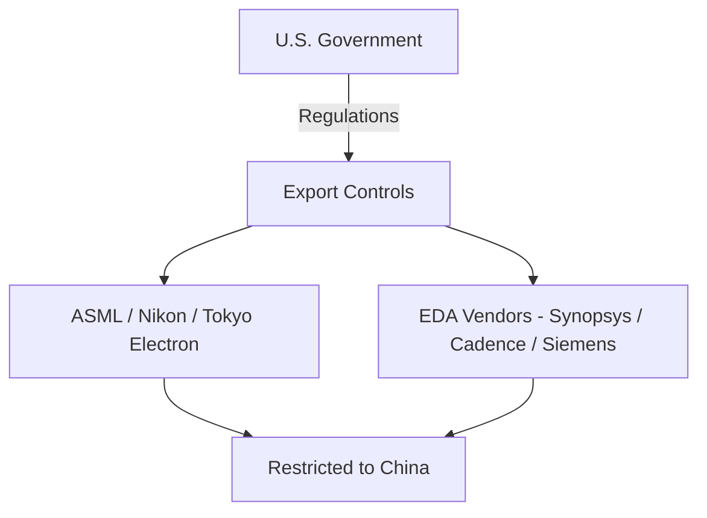

---

# 🌏 2.2 米中対立と半導体規制  
**U.S.–China Rivalry & Semiconductor Export Controls**

---

## 📜 背景 / Background

米中関係は2018年以降、貿易戦争から技術覇権争いへと発展しました。  
半導体はその中心的領域であり、特に先端製造装置・EUVリソグラフィ・EDAツールなどは、  
米国の輸出規制対象として中国メーカーの開発を制約しています。

Since 2018, U.S.–China relations have escalated from a trade war to a technological supremacy contest.  
Semiconductors lie at the core, with restrictions on advanced manufacturing tools, EUV lithography, and EDA software  
limiting the progress of Chinese companies.

---

## 🔍 詳細分析 / Detailed Analysis

### 1) 輸出規制の経緯 / Export Control Timeline
| 年 / Year | 主な動き / Key Actions |
|-----------|------------------------|
| 2019 | Huawei・HiSiliconをエンティティリスト追加 / Huawei & HiSilicon added to Entity List |
| 2020 | SMICへ先端装置輸出制限 / Restrictions on advanced equipment to SMIC |
| 2022 | 米国「半導体規制強化」発表（EDA・DRAM・AIチップ対象） / Expanded U.S. export rules targeting EDA, DRAM, AI chips |
| 2023 | 日本・オランダも先端露光装置規制に同調 / Japan & Netherlands join advanced lithography restrictions |

---

### 2) 制裁対象技術 / Targeted Technologies
- **EUVリソグラフィ装置**（ASML製 High-NA含む）  
- **先端DRAMプロセス**（18nm未満）  
- **AI/HPC向け先端GPU**（NVIDIA A100/H100など）  
- **EDAソフトウェア**（3nm世代以降の設計対応機能）

---

### 3) 中国側の対応 / Chinese Countermeasures
- SMICによる**7nm世代プロセス試作**（DUVマルチパターニング活用）  
- YMTCによる**3D NAND 232層**の開発加速  
- Huaweiによる自社設計SoC（Kirinシリーズ）再始動

---

## 📊 規制構造の模式図 / Export Control Structure

---

## 📚 用語集 / Glossary
- **Entity List** — 米国商務省が規制対象とする企業・団体リスト  
- **DUV / EUV** — Deep/Extreme Ultraviolet Lithography  
- **Multi-Patterning** — 1層を複数露光で形成する微細化技術

---

## 📝 まとめ / Summary
米中対立は半導体分野で技術の分断を加速させ、**「技術ブロック化」**を顕在化させています。  
特にTSMCのような先端製造を担う企業は、輸出規制と顧客関係のバランスを取る難しさに直面しています。

The U.S.–China rivalry accelerates technological decoupling in semiconductors,  
forcing leading fabs like TSMC to navigate between export rules and customer commitments.

---

## 🔗 前後リンク / Navigation
- **◀ 前節 / Previous**: [2.1 台湾の戦略的位置づけとTSMCの依存構造](2_1_taiwan_tsmc_dependency.md)  
- **▶ 次節 / Next**: [2.3 CHIPS法と日米台連携](2_3_chips_act_japan_us_taiwan.md)  
- **🏠 第2章トップ / Chapter 2 Top**: [README](../README.md)
