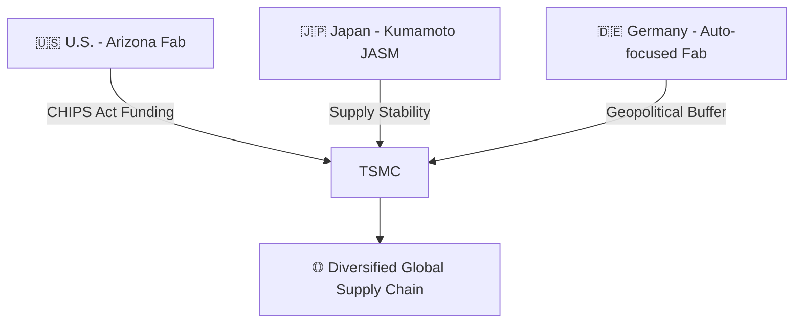

---

# 🌏 2.3 CHIPS法と日米台連携  
**CHIPS Act & Japan–U.S.–Taiwan Cooperation**

---

## 📜 背景 / Background

米国は**CHIPS and Science Act（2022）**により、先端半導体製造の国内回帰を推進しています。  
TSMCはこの流れの中で、アリゾナ州でのFab建設や、熊本工場（JASM）、ドイツFab計画など  
多国間連携を通じて製造拠点を分散しています。

The United States, through the **CHIPS and Science Act (2022)**, is driving the reshoring of advanced semiconductor manufacturing.  
TSMC, in alignment with this policy, is building fabs in Arizona, establishing the Kumamoto plant (JASM) in Japan,  
and planning a fab in Germany as part of a broader multi-national collaboration.

---

## 🏛 政策の概要 / Policy Overview

| 政策 / Policy | 内容 / Description | 意義 / Significance |
|---------------|-------------------|---------------------|
| **CHIPS法（米国）** | 製造設備への最大39B USDの補助金、税控除 | 米国内製造力の回復 |
| **TSMC Arizona** | N4/N3世代Fab建設 | 米国内先端ロジック生産 |
| **JASM（熊本）** | N28/N16世代製造、Sony/トヨタ協力 | 日本の供給安定化 |
| **ドイツFab** | 自動車向け先端ノード | 欧州の地政学的安定化 |

---

## 🤝 三極連携の特徴 / Features of Trilateral Cooperation

1. **技術分散** — 先端製造（米）＋中間世代（日本）＋特殊用途（欧州）の分業化  
   Distributed manufacturing: leading edge (U.S.), mature nodes (Japan), specialized (Europe)  
2. **経済安全保障** — 各地域のサプライチェーン依存リスク軽減  
   Reduces regional supply chain dependency risks  
3. **政治的シナジー** — 米日台間の戦略的パートナーシップ強化  
   Strengthens strategic partnerships among U.S., Japan, and Taiwan  

---

## 📊 三極構造の模式図 / Trilateral Structure Diagram

---

## 📚 用語集 / Glossary
- **CHIPS and Science Act** — 米国半導体産業支援法（2022年制定）  
- **JASM** — Japan Advanced Semiconductor Manufacturing（TSMC熊本工場）  
- **Onshoring / Reshoring** — 生産拠点を国内または近隣地域に戻す戦略  

---

## 📝 まとめ / Summary
CHIPS法を軸にした米日台協力は、単なる産業政策を超え、**地政学的安全保障インフラ**として機能しています。  
TSMCはこの構造の中で、世界規模での**製造拠点多様化戦略**を推進しています。

The U.S.–Japan–Taiwan cooperation under the CHIPS Act functions not only as an industrial policy but also as  
a **geopolitical security infrastructure**, with TSMC leading a **global manufacturing diversification strategy**.

---

## 🔗 前後リンク / Navigation
- **◀ 前節 / Previous**: [2.2 米中対立と半導体規制](2_2_us_china_controls.md)  
- **▶ 次節 / Next**: [2.4 サプライチェーンの地政学的分散と拠点戦略](2_4_supply_chain_geopolitics.md)  
- **🏠 第2章トップ / Chapter 2 Top**: [README](../README.md)
