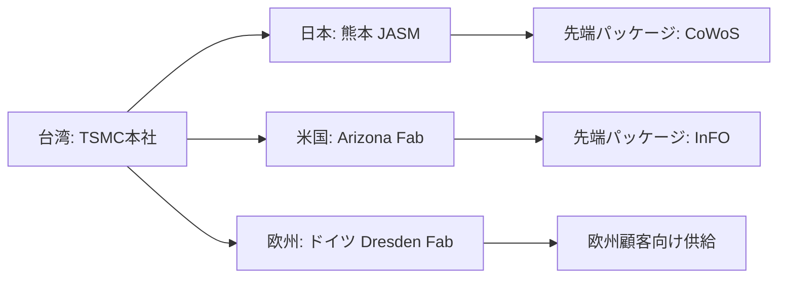

---

# 🌏 2.4 サプライチェーンの地政学的分散と拠点戦略  
**Geopolitical Diversification of Supply Chains**

---

## 📜 背景 / Background
半導体のサプライチェーンは、これまで効率性重視で**特定地域に集中**してきました。  
しかし、米中対立や台湾有事リスクの高まりにより、**地政学的分散**が新たな潮流となっています。  
製造、パッケージ、材料供給、設計拠点を複数の地域に分散することで、**単一障害点（Single Point of Failure）**を回避します。

The semiconductor supply chain has historically been concentrated in specific regions for efficiency.  
However, the rise in **geopolitical risks** such as the U.S.–China rivalry and Taiwan contingency has led to a trend toward **geopolitical diversification**.  
By distributing manufacturing, packaging, material sourcing, and design hubs across multiple regions, the industry aims to avoid **single points of failure**.

---

## 🗺 分散化の主なパターン / Main Patterns of Diversification

| 分散対象 / Target | 分散方法 / Diversification Method | 事例 / Examples |
|-------------------|-----------------------------------|-----------------|
| 製造拠点 / Manufacturing Fabs | 地域別複数Fab建設 | TSMC熊本（日本）、TSMC Arizona（米国）、TSMC Dresden（ドイツ） |
| 材料供給 / Material Supply | サプライヤー多元化 | レジスト供給を日米欧3社体制に |
| 設計拠点 / Design Centers | グローバル分散 | ARM（英）、米国EDA企業、台湾設計ハブ |
| パッケージ拠点 / Packaging Sites | 近接市場展開 | CoWoS台湾・熊本、InFO米国 |

---

## 🛠 拠点戦略の地政学的意義 / Geopolitical Significance of Site Strategy
1. **リスク低減**：地域紛争や災害時の代替生産能力確保  
   Risk mitigation by ensuring backup production during regional conflicts or disasters  
2. **市場アクセス強化**：主要市場近接による輸送コスト削減と納期短縮  
   Enhanced market access by proximity, reducing transport cost and lead time  
3. **同盟国との関係強化**：経済安全保障を前提とした協力体制構築  
   Strengthened alliances through economic security cooperation  

---

## 🌐 サプライチェーン分散の可視化 / Visualization of Supply Chain Diversification

---

## 📚 用語集 / Glossary
- **Single Point of Failure (SPOF)** — 単一障害点  
- **CoWoS (Chip-on-Wafer-on-Substrate)** — 高密度パッケージ技術  
- **InFO (Integrated Fan-Out)** — ファンアウト型パッケージ技術  

---

## 📝 まとめ / Summary
サプライチェーン分散は、単なるリスク回避だけでなく、**戦略的市場展開**と**国際関係強化**の手段でもあります。  
半導体産業は今後、**地政学と経済安全保障を前提にした拠点戦略**が不可欠となります。

Supply chain diversification is not only about risk avoidance but also serves as a **strategic market deployment** and a **tool for strengthening international relations**.  
In the future, site strategies must be designed with **geopolitics and economic security** in mind.

---

## 🔗 前後リンク / Navigation
- **◀ 前節 / Previous**: [2.3 CHIPS法と日米台連携](2_3_chips_japan_us_taiwan.md)  
- **▶ 次節 / Next**: [2.5 台湾有事リスクと経済安全保障政策](2_5_taiwan_contingency.md)  
- **🏠 第2章トップ / Chapter 2 Top**: [README](../README.md)
