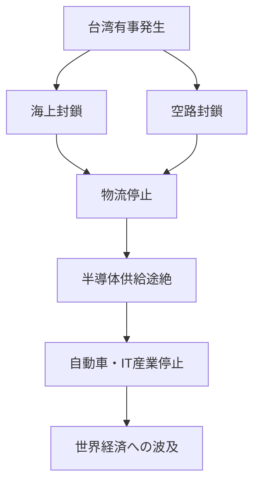

File: e_chapter2_geopolitics/2_5_taiwan_contingency.md
---
layout: default
title: 🌏 2.5 台湾有事リスクと経済安全保障政策 / Taiwan Contingency Risks and Economic Security Policies
---

# 🌏 2.5 台湾有事リスクと経済安全保障政策  
**Taiwan Contingency Risks and Economic Security Policies**

---

## 📜 背景 / Background

台湾有事（Taiwan Contingency）は、半導体産業における**最大の地政学的リスク**の一つです。  
特にTSMCの先端製造能力が台湾に集中している現状では、**軍事衝突や封鎖による供給停止**が  
世界経済全体に深刻な影響を与える可能性があります。

The Taiwan contingency represents one of the **most significant geopolitical risks** in the semiconductor industry.  
Given that TSMC’s cutting-edge manufacturing capacity is concentrated in Taiwan,  
any **military conflict or blockade** could have severe repercussions for the global economy.

---

## 🚨 主なリスク要因 / Key Risk Factors

| 要因 / Factor | 内容 / Details | 影響 / Impact |
|---------------|----------------|---------------|
| 軍事衝突 | 台湾海峡での有事 | 半導体供給の即時停止 |
| 封鎖 | 港湾・空路の遮断 | 国際物流の途絶 |
| サイバー攻撃 | インフラ破壊 | 設備制御・生産ライン停止 |
| 政治的不安定 | 台湾内部の政局変動 | 投資・契約の遅延 |

---

## 🛡 政策対応例 / Policy Response Examples

1. **国内生産能力の強化** — 日本・米国・欧州での先端Fab建設  
   Strengthening domestic production capacity in Japan, U.S., and Europe  
2. **経済安全保障法制の整備** — 戦略物資の備蓄・輸出入規制  
   Establishing economic security laws for stockpiling and trade controls  
3. **国際協力枠組み** — Quad（日米豪印）、G7による半導体連携  
   International cooperation frameworks (Quad, G7 semiconductor initiatives)  

---

## 🌐 台湾有事シナリオと影響範囲 / Taiwan Contingency Scenarios and Impact

---

## 📚 用語集 / Glossary
- **Taiwan Contingency** — 台湾有事、軍事的危機の総称  
- **Economic Security** — 経済安全保障、戦略物資の保全  
- **Quad** — 日米豪印戦略対話  

---

## 📝 まとめ / Summary
台湾有事リスクは、半導体産業の**脆弱性の象徴**とも言える存在です。  
経済安全保障政策は、単なる防衛策ではなく、**技術・産業・外交を一体化した戦略**として設計される必要があります。

The Taiwan contingency risk symbolizes the **core vulnerability** of the semiconductor industry.  
Economic security policies must be designed as an **integrated strategy combining technology, industry, and diplomacy**.

---

## 🔗 前後リンク / Navigation
- **◀ 前節 / Previous**: [2.4 サプライチェーンの地政学的分散と拠点戦略](2_4_supply_chain_geopolitics.md)  
- **🏠 第2章トップ / Chapter 2 Top**: [README](../README.md)
